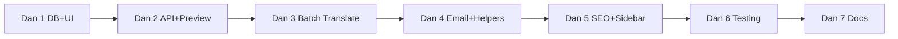

# Tourism Layer – Phase 2 Specifikacije

7-dnevni plan in zahteve "kako mora bit" za Phase 2 Tourism Layer.

---

## Phase 2 Timeline

| Dan | Fokus | Deliverables |
|-----|-------|--------------|
| 1 | Database + Landing Page UI | Prisma modeli, 3-step flow stran |
| 2 | Landing Page API + preview | generate-landing API, Step 3 preview |
| 3 | Batch Translator | batch-translate API, translate stran |
| 4 | Email + Publish Helpers | email stran, generate-email API, publish-helpers.ts, integracija v Generate |
| 5 | SEO + Sidebar | SEO placeholder, sidebar posodobitve |
| 6 | Testing + bug fixes | E2E, mobile, copy-paste preverjanje |
| 7 | Documentation + Phase 3 | TOURISM-LOCAL-TESTING, use-case primeri, Phase 3 planning |

---

## Specifikacije po funkciji

### Database (Dan 1)

- **LandingPage**: id, userId, templateId, name, location, content (JSON po jezikih), createdAt
- **SeoMetric**: id, userId, keyword, position, url, measuredAt
- **TranslationJob**: id, userId, sourceContent, sourceLang, targetLangs, results (JSON), status, completedAt

### Landing Page Generator (Dan 1–2)

- **3 koraki**: Template → Form (ime, lokacija, jeziki) → Preview
- **Predloge**: Standard, Luksuz, Družinski
- **Jeziki**: SL, EN, DE, IT, HR (multi-select)
- **API**: POST /api/tourism/generate-landing
  - Vhod: template, formData
  - Izhod: content po jezikih
- **Preview**: placeholder "Live preview coming soon" + export gumbi (HTML, Vercel, Link)
- **Navigacija**: Možnost vrnitve "← Uredi" na Step 2

### Batch Translator (Dan 3)

- **Stran**: textarea za vsebino, izvorni jezik, multi-select ciljnih jezikov
- **API**: POST /api/tourism/batch-translate
  - Vhod: content, sourceLang, targetLangs
  - Izhod: jobId, translations (object: lang -> text)
- **Persistence**: Shrani TranslationJob v DB
- **Fallback**: brez API key → mock prevodi
- **Rezultat**: prikaz po jezikih z gumbom Kopiraj

### Email Workflow (Dan 4)

- **3 predloge**: Welcome, Follow-up, Sezonska
- **Form polja**: name, location, guestName, check-in/out, jezik, sezona, ponudba
- **API**: POST /api/tourism/generate-email
  - Vhod: prompt (substituiran), variables
  - Izhod: content (generiran email)
- **Output akcije**: Kopiraj, Pošlji prek Gmaila (mailto:)

### Publish Helpers (Dan 4)

- **formatForBooking**: max ~5000 znakov, brez HTML/markdown
- **formatForAirbnb**: max 2 zaporedni prelomi vrstic
- **generateHashtags(location, type)**: max 10 hashtagov, vključi #Slovenia
- **UI**: gumbi "Kopiraj za Booking.com", "Kopiraj za Airbnb", "Kopiraj hashtags" v Tourism Generate po generiranju

### SEO Dashboard (Dan 5)

- Placeholder: mock keywords, predlogi optimizacije
- "Coming soon" za prave podatke

### Sidebar (Dan 5)

- **Tourism Hub**: Overview, Generate, Templates, Landing Page, Email, SEO, Multi-Language
- **Pogoj**: Prikaz samo pri userIndustry tourism / travel-agency

### Testing (Dan 6)

- Landing Page: vsi 3 predloge
- Batch Translate: 2+ jeziki hkrati
- Publish Helpers: copy-paste deluje
- Mobile responsive za vse nove strani

---

## Multi-property Management (Phase 3)

- **Property model**: id, userId, name, location, type, capacity, createdAt, updatedAt
- **User**: activePropertyId (analogno activeTeamId)
- **LandingPage**: propertyId (nullable)
- **UserTemplate**: propertyId (nullable)
- **API**: GET/POST /api/tourism/properties, GET/PATCH/DELETE /api/tourism/properties/[id], GET/POST /api/user/active-property
- **UI**: PropertySelector dropdown (Nastanitev: [Ime] / Vse), stran /dashboard/tourism/properties za CRUD
- **Integracija**: Tourism Overview, Generate (shrani template s propertyId), Templates (filtriraj po propertyId)
- **Sidebar**: Nastanitve link v Tourism Hub
