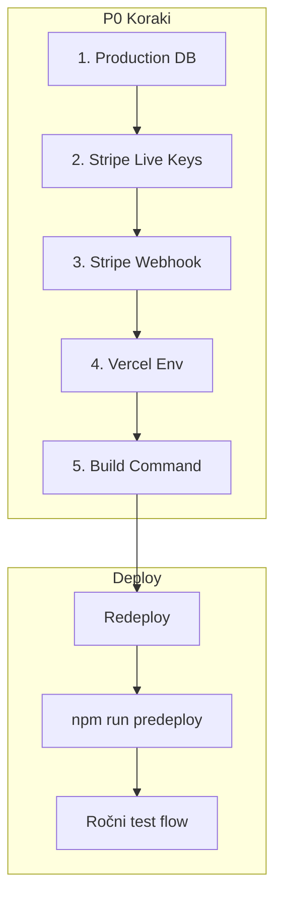

# Launch Runbook – AgentFlow Pro MVP

Kratki vodnik za izvedbo 8.3.5 LAUNCH MVP. Za celovit P0 checklist glej [production-launch-checklist.md](./production-launch-checklist.md).

## Vrstni red korakov



### 1. Production Database

- Ustvari projekt na [Supabase](https://supabase.com) ali [Neon](https://neon.tech)
- Skopiraj connection string (pooler za Vercel)
- Glej [database-setup.md](./database-setup.md)
- **Pred launchom:** Zaženi `npm run db:check` z produkcijskim `DATABASE_URL` v .env.local – preveri povezavo in TLS.

### 2. Stripe Live Keys

- Stripe Dashboard → API Keys (Production mode)
- `sk_live_...`, `pk_live_...`
- Ustvari Pro product + price
- Glej [STRIPE-PRODUCTION-WEBHOOK.md](./STRIPE-PRODUCTION-WEBHOOK.md)

### 3. Stripe Webhook

- Stripe → Developers → Webhooks → Add endpoint
- URL: `https://agentflow-pro-seven.vercel.app/api/webhooks/stripe`
- Events: `checkout.session.completed`, `customer.subscription.updated`, `customer.subscription.deleted`
- Skopiraj `whsec_...`

### 4. Vercel Env Vars

- Vse P0 spremenljivke iz [VERCEL-ENV-CHECKLIST.md](./VERCEL-ENV-CHECKLIST.md)
- Preveri tudi CRON_SECRET (za cron endpointe)
- Preveri: `npm run verify:production-env` (potrebuje .env.local z vrednostmi)

### 5. Build Command (opcijsko)

Za avtomatske migracije pri deployu nastavi Vercel Build Command na:

```
npm run build:vercel
```

Drugače ročno zaženi `npx prisma migrate deploy` pred prvim deployem.

### 6. Redeploy

- Vercel Deployments → Redeploy
- Ali: `git push` na master (če je povezano)

### 7. Predeploy (pred launchom)

```bash
npm run predeploy
```

- Izvede: `verify:production-env` + `test:e2e:smoke`
- Za hitrejši prehod: `npm run predeploy -- --skip-e2e` (po tem ročno zaženi `npm run test:e2e:smoke`)

### 8. Ročni test flow

1. Register → Trial
2. Subscribe (Pro)
3. Generate content (preveri limit)
4. Preveri `https://agentflow-pro-seven.vercel.app/api/health` → `{ ok: true }`

---

## Troubleshooting

| Simptom | Verjeten vzrok | Rešitev |
|--------|----------------|---------|
| `/api/health` vrne 500 ali 503 | `DATABASE_URL` manjka ali napačen | Preveri Vercel env, connection string |
| Stripe eventi ne delujejo (checkout OK, subscription ne) | `STRIPE_WEBHOOK_SECRET` manjka/napačen | Ustvari webhook v Stripe, skopiraj signing secret |
| `verify:production-env` fail | Manjkajoče required env | Glej VERCEL-ENV-CHECKLIST, dopolni .env.local |
| E2E smoke padajo | Flaky testi ali sprememba UI | Zaženi `npm run test:e2e:smoke` lokalno, popravi assertions |
