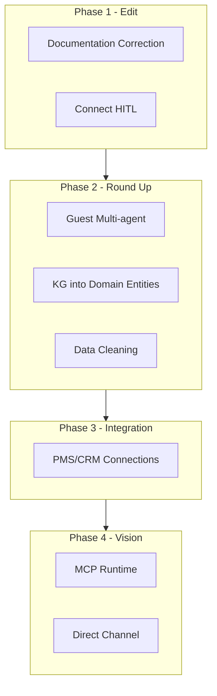

# Research vs. Implementation – AgentFlow Pro Roadmap

Integrated logic from the comparison of both research papers with actual implementation. Use for prioritizing and correcting documentation.

**Source:** Tourism research (AgentFlow Pro semantics, MCP, GEO) + PDF *From MVP to Robust SaaS* + PDF *From Task Automation to Autonomous Flows* (code/commit analysis, suggestions for BPA and HITL) + project (HONEST-FEEDBACK).

---

## 1. Documentation Editing

Research in some parts does not align with the implementation. Corrections to accurately reflect the current state:

| What to correct | Where / how |
|---|---|
| MCP as runtime integration | Clarify: MCP is for development in Cursor; in the application, agents use a REST API. |
| Separate "Storytelling Agent" and "Structured Agent" | Clarify: a single Content Agent with different prompts (Airbnb/Booking.com). |
| Three-agent guest communication | Implemented – Policy/Retrieval/Copy in FAQ flow (guest-communication). |
| Metrics (RevPAR, +18%, +25%) | Mark as industry benchmarks, not AgentFlow Pro's own data. |
| Data cleaning tools | Implemented – endpoint and UI in dashboard. |
| "Hotel MCP server" | Move to vision/roadmap section. |
| Formula $R_e$ | Mention as a conceptual metric, not a measured value. |

**Research delineation:**

- **Implemented** – exists in code
- **Planned** – roadmap
- **Vision** – long-term industry direction

### 1.1 Reference Table – Implemented / Planned / Vision

| Statement | Status | Note |
|---|---|---|
| MCP as runtime | Vision | MCP is for development in Cursor; in the application, agents use a REST API. |
| Storytelling vs Structured Agent | Implemented | One Content Agent with different prompts (Airbnb/Booking.com) in `src/data/prompts.ts`. |
| Three-agent guest communication | Implemented | Policy/Retrieval/Copy in FAQ flow (guest-communication). |
| RevPAR, +18%, +25% | Reference | Industry benchmarks, not AgentFlow Pro's own data. |
| Data cleaning tools | Implemented | Endpoint and UI in dashboard. |
| Hotel MCP server | Vision | Long-term direction – external AI agents call hotel data. |
| Formula $R_e$ | Reference | Conceptual metric, not a measured value. |
| HITL chat flow | Implemented | `hitl.ts` + chat route + ChatEscalation. `ai-agent-production-validation.ts` contains configuration, not runtime logic. |
| Personalization Agent | Implemented | Included in Content Agent (brand tone, platform-specific prompts). |
| Optimization Agent | Partial | Tourism analytics, predictive block; not a standalone agent. |
| Agentic BPA (Reservation to experience) | Planned | PDF From Task Automation suggests; link to Block C #9 (guest multi-agent). |

---

## 2. Prioritized Implementations

### A) Short-term (round up existing)

1. **Connect Human-in-the-loop with actual flow** (done)
   - Actual runtime logic is in `hitl.ts` (estimateConfidence, requiresEscalationForType) and chat route; if confidence < 85% (inquiry_response), a ChatEscalation is created.
   - `ai-agent-production-validation.ts` contains configuration thresholds (e.g., 90%), not runtime escalation code.
   - User display: "Conversation will be transferred to a human" banner on chat page; staff dashboard `/dashboard/escalations`.

2. **Reduce exaggerated claims about agents** (partially done)
   - Clarification added to [FEATURES.md]: for Airbnb/Booking.com, there is one Content Agent with platform-specific content templates, not separate agents.
   - UI (tourism generate) uses the term "Platform-specific templates".

3. **Basic performance measurement**
   - If research mentions RevPAR and conversions, add basic metrics to analytics (response time, number of automatically answered messages).
   - Placeholder for future RevPAR when data becomes available.

### B) Mid-term (to realize research)

4. **Guest multi-agent flow**
   - If you want a three-agent model (Retrieval → Policy → Copy):
   - Retrieval Agent: accesses database (Property, Guest, policies).
   - Policy Agent: checks rules (cancellations, surcharges).
   - Copy Agent: formats the final response in brand tone.
   - Can start simply (e.g., Retrieval + Copy), then add Policy.

5. **Connect Knowledge Graph with user questions**
   - KG exists (Entity, Relation). Expand entities to the tourism domain (Property, Guest, Reservation, Amenity, Policy).
   - Use for answering questions about availability, early check-in, etc.

6. **Data cleaning tool**
   - Deduplication (Guest, Reservation), anomaly detection, field harmonization.
   - Implemented – endpoint and UI in dashboard.

7. **Integration with real PMS/CRM**
   - For real operation, you need at least one integration (Mews, Opera, or HubSpot).
   - To start: one API, without promises of "own MCP server".

### C) Long-term (vision)

8. **MCP as runtime integration**
   - Build an MCP server for AgentFlow Pro for external AI agents to call hotel data.
   - Strategic direction for "fight for direct channel".

9. **GEO and AI search engines**
   - GEO exists in `seo-optimizer.ts`. Expand: automatic FAQ addition, structured data for ChatGPT, Perplexity, etc.

---

## 3. Sequence of Phases

- **Phase 1:** Documentation correction + connect HITL.
- **Phase 2:** Guest multi-agent, KG into domain entities, data cleaning.
- **Phase 3:** PMS/CRM integrations.
- **Phase 4:** MCP runtime, "direct channel".

---

## 4. Combined Priority Plan (Blocks A–D)

Comparison of three sources shows the following sensible steps. For details, see PDF *From MVP to Robust SaaS* in the project root.

### Block A: Immediate (1–2 weeks)

| # | Task | Source | Reason |
|---|---|---|---|
| 1 | Include HITL in chat flow | Tourism research | Done: hitl.ts + chat route + ChatEscalation + staff dashboard + Slack/Email notifications. |
| 2 | Booking.com – start registration | PDF, HONEST-FEEDBACK | 4–8 weeks waiting; see [BOOKING-COM-REGISTRATION.md](BOOKING-COM-REGISTRATION.md). |
| 3 | Documentation correction | Tourism research | Clear boundary implemented/planned. |

### Block B: Before / during beta (2–4 weeks)

| # | Task | Source | Reason |
|---|---|---|---|
| 4 | Stripe Live verification | PDF | Keys and webhooks must work in production. |
| 5 | Load test (k6) | PDF | See [LOAD-TEST-K6.md](LOAD-TEST-K6.md). |
| 6 | hreflang for SEO | PDF | See [HREFLANG-SEO.md](HREFLANG-SEO.md). |
| 7 | Resilience verification in runtime | PDF | See [RESILIENCE-VERIFICATION.md](RESILIENCE-VERIFICATION.md). |
| 8 | CI/CD robustness, interactive setup script (init/setup), mock maintenance | PDF From Task Automation | Faster and more reliable development cycle. |

### Block C: Mid-term (1–3 months)

| # | Task | Source | Reason |
|---|---|---|---|
| 8 | Predictive analytics | PDF | Differentiator, higher pricing. |
| 9 | Guest multi-agent (Retrieval + Copy) | Tourism research | See [GUEST-MULTI-AGENT.md](GUEST-MULTI-AGENT.md). |
| 10 | KG into tourism entities | Tourism research | See [KG-TOURISM-ENTITIES.md](KG-TOURISM-ENTITIES.md). |
| 11 | LangSmith or similar | PDF | See [LANGSMITH-SETUP.md](LANGSMITH-SETUP.md). |
| 12 | HITL upgrade: confidence-driven approval flow (anomalies, reservation thresholds) | PDF From Task Automation | Dynamic decision on when human intervention is needed. |
| 13 | Agentic BPA workflow "Reservation to guest experience" | PDF From Task Automation | Automation of the entire flow from reservation to post-stay survey; link to #9. |

### Block D: Postpone (after beta / first customers)

| Task | Why postpone |
|---|---|
| Agent containerization (RabbitMQ) | Too much for MVP; monolith suffices. |
| MCP runtime | Vision, not needed for first customers. |
| Hybrid pricing (pay-as-you-go) | Stripe tiered suffices for a start. |
| EU AI Act in compliance | After stable beta. |

---

## 5. Usage Recommendations

- **Research as sales material:** Focus on Phase 1 (corrections) + clear delineation Implemented / Planned / Vision.
- **Research as internal roadmap:** Focus on Phases 2–4; research becomes a guide for development priorities.
- **MVP for guest communication:** Phase 1 (HITL) + start of Phase 2 (multi-agent, KG into tourism entities).
- **Resource alignment:** Tourism research → AI (HITL, multi-agent, KG). PDF → production (Booking.com, load test, hreflang, observability).

---

## 6. What aligns with research (reference)

| Statement | Actual status |
|---|---|
| Knowledge Graph | Entity, Relation in `src/memory/`. Entities: Agent, Workflow, Task, User, Deploy. |
| Airbnb storytelling vs Booking.com | Different prompts in `src/data/prompts.ts`. One Content Agent, different prompts. |
| GEO optimization | `seo-optimizer.ts`: suggestGeoHints(), suggestAeoHints(). |
| Approval processes | WorkflowCheckpoint + requiresApproval in WorkflowExecutor. |
| No-code interface | React Flow workflow builder, checkbox requiresApproval. |
