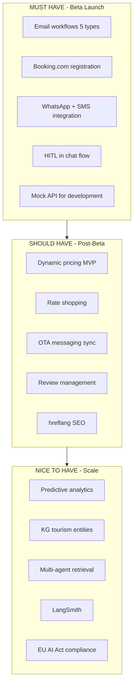

# Tourism Email Workflows – Roadmap & Research

Roadmap for implementing email automation, guest communications, pricing, dynamic pricing, and OTA API integrations in AgentFlow Pro (tourism vertical). This document contains comparison with proposal, verified benchmarks, key requirements, Booking.com Connectivity Hub, hospitality channels 2025, and implementation plan. For further research and opinions – see section at the end.

---

## 1. Comparison: Proposal vs. AgentFlow Pro (current state)

| Function | Proposal | AgentFlow Pro currently |
|----------|---------|------------------------|
| Event triggers (`reservation.created`, `check_in`, `check_out`) | Yes | No – no webhook on reservation creation |
| Time delays (`-7_days`, `+1_day`, `+60_days`) | Yes | Partial – `scheduledFor` manually, no scheduler |
| Channels (email, sms, whatsapp) | Yes | email, sms, phone – WhatsApp missing |
| Booking confirmation (immediate) | Yes | No |
| Pre-arrival (3–7 days) | Yes | Partial – type `pre-arrival`, no auto-trigger |
| Check-in instructions (24h before) | Yes | No – `check_in` in agent, no scheduler |
| During-stay upsell (day 2–3) | Yes | No |
| Post-stay review (24h after departure) | Yes | Partial – type `post-stay`, no auto-trigger |
| Re-booking campaign (30–90 days) | Yes | No |

---

## 2. Benchmark Research (verified sources)

| Statement in proposal | Research / sources | Realistic value |
|--------------------|------------------|----------------------|
| Booking confirmation 95% open | Revinate, MarTech: 56–72% for travel/transactional | **65–75%** |
| Pre-arrival 45% open | Mews, GuestTouch: up to ~60%, APAC 43–48% | **45% OK** |
| Check-in 24h: 60% open | No direct source – operational emails have higher open | **60% OK** |
| During stay 13x conversion | No source for "13x". Hospitalitynet: TRevPAR +2–5% | **High impact, 13x unproven** |
| Post-stay 35% response | GuestRevu: typically 20–22%, well optimized 25–35% | **35% = best case** |
| Re-booking 22% conversion | Revinate: 41% open, 5% CTR | **22% questionable – clearly define metric** |

### Reference Sources
- [Revinate 2025 Hospitality Benchmark](https://www.revinate.com/hospitality-benchmark-report/)
- [Mews – Hotel Pre-Arrival Emails](https://mews.com/en/blog/hotel-pre-arrival-emails)
- [GuestTouch – Pre-Arrival](https://www.guesttouch.com/blog/mastering-pre-arrival-emails-proven-templates-strategies-for-hotels-with-examples)
- [Hospitalitynet – Total revenue management](https://www.hospitalitynet.org/explainer/4129204.html)

---

## 3. Proposed `EMAIL_WORKFLOWS` Structure

```typescript
// src/lib/tourism/email-workflows.ts (or guest-email-workflows.ts)

export const EMAIL_WORKFLOWS = {
  booking_confirmation: {
    trigger: 'reservation.created',
    delay: 'immediate',
    channels: ['email', 'sms', 'whatsapp'],
    variables: ['guest_name', 'property_name', 'check_in', 'check_out', 'total_price']
  },
  pre_arrival: {
    trigger: 'reservation.check_in',
    delay: '-7_days',
    upsell_opportunities: ['airport_transfer', 'early_checkin', 'breakfast'],
    variables: ['local_events', 'weather_forecast', 'parking_info']
  },
  check_in_instructions: {
    trigger: 'reservation.check_in',
    delay: '-24h',
    channels: ['email', 'sms'],
    variables: ['access_info', 'parking', 'wifi', 'contact']
  },
  during_stay_upsell: {
    trigger: 'reservation.stay_day',
    delay: '+2_days',
    upsell_opportunities: ['spa', 'dining', 'late_checkout', 'room_upgrade'],
    variables: ['guest_preferences', 'previous_purchases']
  },
  post_stay_review: {
    trigger: 'reservation.check_out',
    delay: '+1_day',
    channels: ['email', 'sms'],
    review_platforms: ['Booking.com', 'Google', 'TripAdvisor']
  },
  re_booking_campaign: {
    trigger: 'reservation.check_out',
    delay: '+60_days',
    variables: ['seasonal_offers', 'loyalty_discount', 'same_dates_discount']
  }
}
```

---

## 4. Implementation Plan

### Phase 1: Infrastructure
- [ ] `EMAIL_WORKFLOWS` configuration
- [ ] Daily cron / scheduler for time-dependent emails
- [ ] Event hook on `reservation.created` (PMS sync or manual create)

### Phase 2: Core workflows
- [ ] Booking confirmation (immediate on create)
- [ ] Pre-arrival (check_in - 7 days)
- [ ] Check-in instructions (check_in - 24h)
- [ ] Post-stay review (check_out + 1 day)

### Phase 3: Upsell & retention
- [ ] During-stay (check_in + 2 days, until check_out)
- [ ] Re-booking (check_out + 60 days)

### Phase 4: Channels (guest communications)
- [ ] `src/lib/guest-communication.ts` – COMMUNICATION_CHANNELS, AI_MESSAGE_TYPES
- [ ] WhatsApp integration (Twilio/Meta)
- [ ] OTA Messaging (Booking.com, Airbnb inbox)
- [ ] Review management – auto-responses, sentiment analysis

### Phase 5: Pricing Engine
- [ ] `src/lib/pricing-engine.ts` – PRICING_STRATEGIES configuration
- [ ] Integration with `competitor-prices` and `analytics` (occupancy)
- [ ] MVP: base_rate + rules (min_stay, early_bird, last_minute, weekend)
- [ ] Advanced: dynamic_adjustment factors

### Phase 6: OTA Integrations (Booking.com, Airbnb)
- [ ] `src/lib/booking-com-integration.ts` – BOOKING_COM_REQUIREMENTS
- [ ] Migration to Connectivity Hub (OAuth 2.0 by Dec 2025)
- [ ] Rates & Availability API integration
- [ ] Circuit breaker + retry for reservation fallback
- [ ] Airbnb: via channel manager or Homes API partnership

---

## 5. Key Requirements (email & communication)

| Requirement | Source | AgentFlow Pro | Meaningfulness |
|---------|-----|---------------|------------|
| Automated synchronization of guest data to email tool | [Inntopia](https://corp.inntopia.com/email/) | PMS sync exists, Guest+Reservation in DB – no auto-sync in email workflow | High |
| Behavioral triggers (guest behavior) | [Revinate](https://www.revinate.com) | Only manual/scheduled – no event-driven behavioral triggers | High |
| Omnichannel (email + WhatsApp + SMS + OTA messaging) | [Hotelyearbook](https://www.hotelyearbook.com) | Email, sms, phone – WhatsApp and OTA messaging missing | High |
| Personalization (names, preferences, history) | [SuitePad](https://www.suitepad.de) | Guest has name, email, phone – no preferences, stay history, segmentation | High |

---

## 6. Pricing & Dynamic Pricing

| Feature | Source | AgentFlow Pro | Meaningfulness |
|----------|-----|---------------|------------|
| Dynamic Pricing (real-time on demand) | [SiteMinder](https://www.siteminder.com), RateGain | No – basePrice static | High |
| Rate Shopping (monitoring OTA competition) | [RateTiger](https://ratetiger.com), [Makcorps](https://www.makcorps.com) | Competitor + CompetitorPrice – manual scraping, no real-time | Medium |
| Seasonal Adjustments (4 seasons + event) | MySoftInn, RMS | SeasonalContentScheduler for content, not pricing | High |
| Length-of-Stay Pricing (discounts for longer stays) | RoomPriceGenie, [Chekin](https://chekin.com) | No | Medium |
| Last-Minute Deals (automatic discounts for empty rooms) | HotelTechReport | No | Medium |

**Priority:** MVP start with Seasonal + LOS; real rate shopping requires RateTiger/Makcorps API or specialized tool.

---

## 7. Pricing Engine – Proposed Structure

File `src/lib/pricing-engine.ts` currently **does not exist**. Proposed structure:

```typescript
// src/lib/pricing-engine.ts

export const PRICING_STRATEGIES = {
  base_rate: {
    type: 'fixed',
    variables: ['room_type', 'season', 'day_of_week']
  },
  dynamic_adjustment: {
    type: 'ai_optimized',
    factors: [
      'competitor_rates',
      'demand_forecast',
      'booking_pace',
      'local_events',
      'weather_forecast',
      'historical_occupancy'
    ],
    update_frequency: 'daily'
  },
  rules: {
    min_stay_discount: { threshold: 7, discount: '15%' },
    early_bird: { days_before: 60, discount: '10%' },
    last_minute: { days_before: 3, discount: '20%' },
    weekend_premium: { days: ['fri', 'sat'], premium: '25%' }
  }
}
```

**Assessment:** Industry-aligned (SiteMinder, RateTiger, RoomPriceGenie). Suggestions:
- `discount`/`premium` as decimal value (0.15) for calculation
- Add `length_of_stay` with stepped discounts (3 nights → 15%, 5 nights → 20%)
- `last_minute`: optional `min_occupancy_threshold`

---

## 8. API Integrations for Pricing

| API | Purpose | Priority | Note |
|-----|-------|------------|--------|
| [RateGain](https://www.rategain.com) | Rate shopping, competitor intelligence | Medium | Established in hotel tech |
| [SiteMinder](https://www.siteminder.com) | Channel management + pricing | Medium | Dynamic Revenue Plus, broader scope |
| **Booking.com Rates API** | Price synchronization (Connectivity Hub) | **High** | OTA_HotelAvailNotif, OTA_RateAmountNotif, LOS |
| **Airbnb Pricing API** | Price synchronization | **High** | Homes API – access via channel managers or partnership |

---

## 9. Booking.com Connectivity Hub – Reservations (minimum requirements)

| Requirement | Value | Deadline | Source |
|---------|----------|-----|-----|
| Reservation API Fallbacks | < 5% per month | Continuous | connectivity.booking.com |
| Authentication | Token-based (OAuth 2.0) | Dec 2025 | Basic auth sunset 31.12.2025 |
| Rates & Availability API | Real-time sync | On registration | [Rates & Availability](https://developers.booking.com/connectivity/docs/ari) |
| Content API | Modular API | H2 2025 | Roadmap |
| Payment Details API | New standard | May 2025 | [developers.booking.com](https://developers.booking.com/connectivity/docs) |
| Demand API | v3.2 Latest | Current | leapshq.com |
| OTA_HotelSummaryNotif | DEPRECATED | Dec 2026 removal | Check [Deprecation policy](https://developers.booking.com/connectivity/docs/deprecation-policy/deprecation-and-sunsetting) |

**Current AgentFlow Pro state:** `integrations/bookingCom.ts` uses `distribution-xml.booking.com` (likely Distribution API), not Connectivity Hub. For Connectivity partner status, migration to Connectivity API + OAuth 2.0 is required.

---

## 10. Booking.com Integration – Proposed Structure

File `src/lib/booking-com-integration.ts` currently **does not exist**. Proposed structure:

```typescript
// src/lib/booking-com-integration.ts

export const BOOKING_COM_REQUIREMENTS = {
  certification: {
    timeline: '4-8_weeks',
    steps: [
      'partner_registration',
      'api_implementation',
      'testing_sandbox',
      'certification_audit',
      'production_go_live'
    ]
  },
  api_endpoints: {
    rates_availability: '/rates/2.0',
    reservations: '/reservations/1.0',
    content: '/content/1.0',
    payments: '/payments/1.0'
  },
  monitoring: {
    fallback_threshold: '5%',
    check_frequency: 'daily',
    alert_channels: ['email', 'slack', 'sentry']
  },
  fallback_strategy: {
    circuit_breaker: true,
    retry_logic: 'exponential_backoff',
    manual_override: true
  }
}
```

**Note:** Check endpoint paths in [API reference](https://developers.booking.com/connectivity/docs/api-reference). `fallback_threshold` as target KPI.

---

## 11. Critical Steps (Booking.com Connectivity)

| Step | Action |
|-------|--------|
| **TODAY** | Start registration as Connectivity Partner on [connectivity.booking.com](https://connectivity.booking.com) / [partner.booking.com](https://partner.booking.com) |
| **Mock API** | Develop mock layer for development without waiting for approval (AgentFlow has `MockBookingComAPI`) |
| **Fallback** | Enable manual availability entry while waiting for API approval |
| **Monitoring** | Set alerts for fallback rate > 5% |

---

## 12. Guest Communications – 2025 Trends

| Channel | Usage | Priority | Source | AgentFlow Pro |
|-------|---------|------------|-----|---------------|
| WhatsApp | Real-time, check-in | High | [Chekin](https://chekin.com), SendSquared | No – missing |
| SMS | Urgent notifications, OTP | High | [Canary](https://www.canarytechnologies.com) | Yes |
| Email | Formal messages, invoices | High | HotelTechReport | Yes |
| OTA Messaging | Booking.com, Airbnb chat | High | Hotelyearbook | No |
| Instagram/FB | Marketing, inquiries | Medium | Hotelyearbook | No |
| In-App Chat | Own app | Low | Upriser | Partial – chat exists |

---

## 13. Guest Communication – Proposed Structure

File `src/lib/guest-communication.ts` (or `guest-communication-channels.ts`) currently **does not exist**. Proposed structure:

```typescript
// src/lib/guest-communication.ts

export const COMMUNICATION_CHANNELS = {
  whatsapp: {
    provider: 'Twilio/Meta',
    use_cases: ['check_in_instructions', 'upsell_offers', 'urgent_notifications'],
    response_time_sla: '<15_minutes'
  },
  sms: {
    provider: 'Twilio',
    use_cases: ['otp_verification', 'emergency_alerts', 'booking_confirmations'],
    response_time_sla: '<5_minutes'
  },
  email: {
    provider: 'SendGrid/Resend',
    use_cases: ['invoices', 'detailed_information', 'marketing_campaigns'],
    response_time_sla: '<1_hour'
  },
  ota_messaging: {
    platforms: ['Booking.com', 'Airbnb', 'Expedia'],
    use_cases: ['guest_inquiries', 'reservation_changes'],
    response_time_sla: '<1_hour'
  }
}

export const AI_MESSAGE_TYPES = {
  inquiry_response: { confidence_threshold: 0.85, hitl_below: true },
  upsell_offer: { confidence_threshold: 0.75, hitl_below: false },
  complaint_handling: { confidence_threshold: 0.90, hitl_below: true },
  review_response: { confidence_threshold: 0.80, hitl_below: true }
}
```

**Assessment:** More granular HITL by message type than current uniform `CONFIDENCE_THRESHOLD = 0.9` in `src/lib/hitl.ts`.

---

## 14. Key Requirements (补充)

| Requirement | Source | AgentFlow Pro |
|---------|-----|---------------|
| Centralized dashboard – all messages in one place | [Hoop](https://hoop.expert) | guest-communication dashboard – no OTA/WhatsApp |
| AI + HITL – automatic responses + human validation | [Callin](https://callin.io) | hitl.ts, guest-copy-agent – proposed AI_MESSAGE_TYPES |
| Response time SLA – <15 min WhatsApp, <1h email | [Canary](https://www.canarytechnologies.com) | Not defined |
| Upsell integration – automatic offers during stay | HotelTechnologyNews | No |

---

## 15. Competitive Analysis

### Jasper alternatives (general AI content)

| Tool | Price | Tourism | Source |
|--------|------|---------|-----|
| Copy.ai | $49/month | No | republishai.com |
| Writesonic | $20/month | No | wpmet.com |
| Rytr | $9/month | No | eesel.ai |
| ContentMonk | $99/month | No | contentmonk.io |
| **AgentFlow Pro** | $59–499/month | **Yes** | – |

### Tourism-specific platforms (2025)

| Platform | Focus | Price | Missing | Source |
|-----------|-------|------|--------|-----|
| Revinate | Email marketing | $299+/month | AI agents, workflow | revinate.com |
| Cendyn | Guest communication | Custom | Multi-agent, KG | hoteltechreport.com |
| Hoop | Omnichannel messaging | $199+/month | Content generation | hoop.expert |
| Enso Connect | Short-term rental AI | $99+/month | Hotels, DMO | ensoconnect.com |
| Guesty | Airbnb automation | $99+/month | Content, SEO | guesty.com |
| RateGain | Pricing intelligence | Custom | Content, communication | rategain.com |

### AgentFlow Pro Differentiators

- Multi-Agent Flow – Research + Content + Reservation + Communication
- Knowledge Graph – Tourism entities, contextual responses
- Unified Platform – content + reservations + communication in one place
- Pay-per-use – flexible pricing
- Compliance – GDPR, EU AI Act, licensing

---

## 16. Implementation Plan by Blocks

### Block A: Immediate (1–2 weeks)

| # | Function | Source |
|---|----------|-----|
| 1 | Email workflows – 5 templates (booking, pre-arrival, during, post-stay, re-book) | Revinate |
| 2 | Booking.com registration – start TODAY | connectivity.booking.com |
| 3 | WhatsApp integration – Twilio/Meta API | Chekin |
| 4 | HITL in chat – confidence threshold + escalation | Callin |
| 5 | Mock Booking API – development without waiting | lodgify.com |

### Block B: Before/During Beta (2–4 weeks)

| # | Function | Source |
|---|----------|-----|
| 6 | Dynamic pricing MVP – basic rules + seasonal | SiteMinder |
| 7 | Rate shopping integration | Makcorps |
| 8 | OTA messaging sync – Booking.com + Airbnb chat | Hotelyearbook |
| 9 | Review management – auto-responses + sentiment | Hoop |
| 10 | hreflang SEO – 3 languages (EN, DE, IT) | **Implemented** – HREFLANG-SEO.md |

### Block C: Mid-term (1–3 months)

| # | Function | Source |
|---|----------|-----|
| 11 | Predictive analytics – demand forecasting | HotelTechReport |
| 12 | KG tourism entities | aitechinsights.com |
| 13 | Multi-agent retrieval – Research + Copy | Callin |
| 14 | LangSmith integration | **Documented** – LANGSMITH-SETUP.md |
| 15 | EU AI Act compliance | hotelsmarters.com |

---

## 17. Priority Diagram



---

## 18. One-Line Action

| Period | Actions |
|---------|--------|
| **Today** | Start Booking.com registration + implement 5 email workflows + WhatsApp integration |
| **This Week** | HITL in chat + mock API for development |
| **Next Week** | Dynamic pricing MVP + rate shopping + OTA messaging |
| **After Beta** | Predictive analytics + KG + LangSmith |

---

## 19. Current Code (Reference)

- `src/app/api/tourism/guest-communication/route.ts` – GET/POST guest emails
- `src/agents/communication/communicationAgent.ts` – messageType: pre_arrival, post_stay, check_in, check_out
- `src/workflows/tourism-workflows.ts` – `guest_automation` use case
- `src/app/api/tourism/pms-sync/route.ts` – reservations from PMS (no trigger)
- `src/app/api/tourism/competitor-prices/route.ts` – competitor tracking (for pricing-engine)
- `src/app/api/tourism/analytics/route.ts` – occupancy (for pricing-engine)
- `src/integrations/bookingCom.ts` – Distribution API (migration to Connectivity Hub)
- `src/lib/booking-com-partnership.ts` – partnership application
- `src/lib/hitl.ts` – CONFIDENCE_THRESHOLD 0.9 (proposed: AI_MESSAGE_TYPES by type)
- `src/lib/tourism/guest-copy-agent.ts` – confidence in responses
- `docs/BOOKING-COM-REGISTRATION.md` – registration steps
- `prisma`: `GuestCommunication`, `Reservation`, `Guest`, `Competitor`, `CompetitorPrice`

---

## 20. Research & Opinions – for补充

*Add new research, sources, and opinions here. Date and brief description.*

```
<!--
Example:
- 2025-02-XX: [source] – XYZ finding
- 2025-02-XX: Opinion: priority during-stay before re-booking
-->
```
