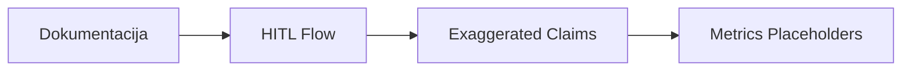
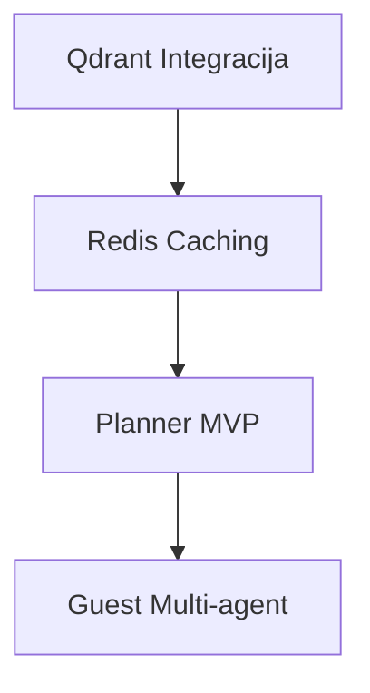
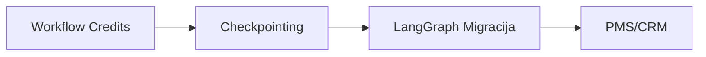
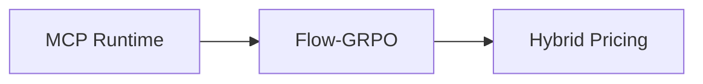

# AgentFlow Pro: Raziskava vs. Implementacija - Hitra referenca

**Namen:** Hitra orientacija - kaj je implementirano, kaj je načrtovano, kaj je vision.

---

## 🚦 Statusni pregled

| Komponenta | Status | Lokacija | Opomba |
|------------|--------|----------|--------|
| **Research Agent** | ✅ Implementirano | `src/agents/research/ResearchAgent.ts` | Firecrawl, Context7, web search |
| **Content Agent** | ✅ Implementirano | `src/agents/content/ContentAgent.ts` | Airbnb/Booking.com prompti |
| **Code Agent** | ✅ Implementirano | `src/agents/code/CodeAgent.ts` | GitHub MCP, code generation |
| **Deploy Agent** | ✅ Implementirano | `src/agents/deploy/DeployAgent.ts` | Vercel deploy |
| **Personalization Agent** | ✅ Implementirano | `src/agents/personalization/PersonalizationAgent.ts` | Brand tone, user preferences |
| **Image Agent** | ✅ Implementirano | `src/features/agents/multimodal/image-agent.ts` | FLUX, Gemini image generation |
| **Reservation Agent** | ✅ Implementirano | `src/agents/reservation/reservationAgent.ts` | Booking, pricing |
| **Communication Agent** | ✅ Implementirano | `src/agents/communication/CommunicationAgent.ts` | Email, Slack, notifications |
| **Optimization Agent** | ⚠️ Delno | `src/agents/optimization/OptimizationAgent.ts` | Tourism analytics, ni standalone |
| **Planner Modul** | ❌ Ni | - | Ni dinamičnega razčlenjevanja |
| **Verifier Service** | ✅ Implementirano | `src/verifier/VerifierService.ts` | Validacija outputov |
| **Orchestrator** | ✅ Implementirano | `src/orchestrator/Orchestrator.ts` | Lastna implementacija (brez LangGraph) |
| **Workflow Executor** | ✅ Implementirano | `src/workflows/executor.ts` | React Flow integration |
| **HITL (Human-in-the-Loop)** | ✅ Implementirano | `src/lib/hitl.ts` | Confidence estimation, escalation |
| **Escalation Dashboard** | ✅ Implementirano | `/dashboard/escalations` | Staff UI za prevzem |
| **Knowledge Graph** | ✅ Implementirano | `src/memory/` (Entity, Relation) | InMemoryBackend, brez Neo4j |
| **Vector Search (Qdrant)** | ❌ Ni | - | Načrtovano za RAG |
| **Redis Caching** | ❌ Ni | - | Omenjen v project-brief |
| **MCP (Model Context Protocol)** | ⚠️ Development | `.mcp.json` | Cursor MCP, ne runtime |
| **LangGraph** | ❌ Ni | - | Lasten orchestrator |
| **Flow-GRPO / RL** | ❌ Ni | - | Ni RL optimizacije |
| **Stripe Billing** | ✅ Implementirano | `src/stripe/` | 3 tiers: Starter/Pro/Enterprise |
| **Workflow Credits** | ❌ Ni | - | Uporablja `agentRuns` |

---

## 📊 Arhitekturna primerjava

### Raziskava (Idealni model)

```
┌─────────────────────────────────────────────┐
│              Planner Modul                  │
│  (Query → Sub-goals, Dynamic Re-planning)   │
└─────────────────┬───────────────────────────┘
                  │
┌─────────────────▼───────────────────────────┐
│            Executor Modul                   │
│  (Tools: MCP, APIs, LangGraph, AutoGen)     │
└─────────────────┬───────────────────────────┘
                  │
┌─────────────────▼───────────────────────────┐
│           Verifier Modul                    │
│  (Quality Check, Verified Reward, Re-plan)  │
└─────────────────┬───────────────────────────┘
                  │
┌─────────────────▼───────────────────────────┐
│          Generator Modul                    │
│  (Synthesize Final Response)                │
└─────────────────────────────────────────────┘
```

### AgentFlow Pro (Realnost)

```
┌─────────────────────────────────────────────┐
│         User Query / Trigger                │
└─────────────────┬───────────────────────────┘
                  │
┌─────────────────▼───────────────────────────┐
│      Orchestrator (Lastna implementacija)   │
│  (Task Queue, Max 3 Concurrent)             │
└───────┬──────────────┬──────────────┬───────┘
        │              │              │
┌───────▼──────┐  ┌───▼────────┐  ┌─▼──────────┐
│Research Agent│  │Content Agent│  │Code Agent  │
└──────────────┘  └────────────┘  └────────────┘
        │              │              │
┌───────▼─────────────────────────────▼───────┐
│         VerifierService                     │
│  (Schema Validation: research/content/code) │
└─────────────────┬───────────────────────────┘
                  │
┌─────────────────▼───────────────────────────┐
│         HITL (če confidence < 0.9)          │
│  (/dashboard/escalations, Slack/Email)      │
└─────────────────────────────────────────────┘
```

---

## 🎯 Prioritetni roadmap

### Takoj (1-2 tedna)



**Taski:**
- ✅ Popraviti `docs/RESEARCH-VS-IMPLEMENTATION-ROADMAP.md` § 1.1
- ✅ Dokumentirati HITL flow (`hitl.ts` + chat route)
- ✅ Jasno označiti industry benchmarks vs. actual data

### Srednjoročno (2-4 tedne)



**Taski:**
- ❌ Qdrant client + indexiranje (policy, FAQ)
- ❌ Redis client + session caching
- ❌ Planner Service (decompose query → sub-goals)
- ❌ Guest multi-agent (Retrieval → Policy → Copy)

### Dolgoročno (1-3 mesece)



**Taski:**
- ❌ Credits sistem (namesto `agentRuns`)
- ❌ `checkpoint_id` za HITL rekonstrukcijo
- ❌ LangGraph migracija (kompleksni workflow-i)
- ❌ PMS integracija (Mews, Opera)

### Vision (3-6+ mesecev)



**Taski:**
- 🔮 MCP server za external AI agente
- 🔮 RL optimizacija (Flow-GRPO)
- 🔮 Hybrid pricing (pay-as-you-go)

---

## 🔍 Kdaj kateri dokument uporabiti

| Vprašanje | Dokument |
|-----------|----------|
| Kaj manjka glede na raziskavo? | `docs/RAZISKAVA-ARHITEKTURA-ANALIZA.md` (ta dokument) |
| Kaj je implementirano? | `docs/RESEARCH-VS-IMPLEMENTATION-ROADMAP.md` § 1.1 |
| Tehnični roadmap (Planner, Verifier, LangGraph)? | `docs/AGENTFLOW-ECOSYSTEM-COMPARISON.md` |
| Produkcijska robustnost (load test, hreflang)? | PDF "Od MVP do Robustnega SaaS" |
| BPA strategija, HITL nadgradnja? | PDF "Od Avtomatizacije Nalog do Autonomnih Tokov" |
| Konkurenčna analiza (Jasper)? | `docs/JASPER-GAP-ANALYSIS.md` |

---

## 📈 Metrike

### Tehnične metrike (trenutne)

| Metrika | Vrednost | Cilj | Status |
|---------|----------|------|--------|
| Agent Reliability | Ni meritve | 99.5% | ❌ Ni monitoringa |
| Error Rate | Ni meritve | <0.1% | ❌ Ni monitoringa |
| Response Time | Ni meritve | <2s | ❌ Ni monitoringa |
| HITL Escalation Rate | Ni meritve | <10% | ❌ Ni monitoringa |
| Confidence Score | Heuristic | >0.9 | ✅ Implementirano |

### Business metrike (cilji)

| Metrika | Cilj | Status |
|---------|------|--------|
| MVP v 7 dneh | ✅ | Doseženo |
| First customer v 30 dneh | 🟡 | V teku |
| $1,000 MRR v 60 dneh | 🔴 | Ni začeto |
| $10,000 MRR v 180 dneh | 🔴 | Ni začeto |

---

## 🛠 Priporočila

### Za CTO / Arhitekte

1. **Ohraniti trenutno arhitekturo** - 4 domenski agenti so dovolj
2. **Dodati Qdrant** - Kritično za RAG (guest communication)
3. **Dodati Redis** - Performance pri visoki obremenitvi
4. **Razmisliti o Plannerju** - Samo za kompleksne query-je

### Za Product Managerje

1. **Popraviti dokumentacijo** - Jasna meja implementirano/načrtovano
2. **Zmanjšati "exaggerated claims"** - Verodostojnost > marketing
3. **Dodati realne metrike** - Industry benchmarks označiti kot take

### Za Razvoj

1. **Faza 1 (takoj):** Qdrant client, Redis client
2. **Faza 2 (2-4 tedne):** Planner MVP, Guest multi-agent
3. **Faza 3 (1-3 mesece):** Workflow credits, checkpointing

---

## 📞 Kontakti

- **AI Team Lead:** ai-team@agentflow-pro.com
- **CTO:** cto@agentflow-pro.com
- **Product:** product@agentflow-pro.com

---

**Zadnja posodobitev:** 17. marec 2026  
**Naslednji review:** 24. marec 2026
