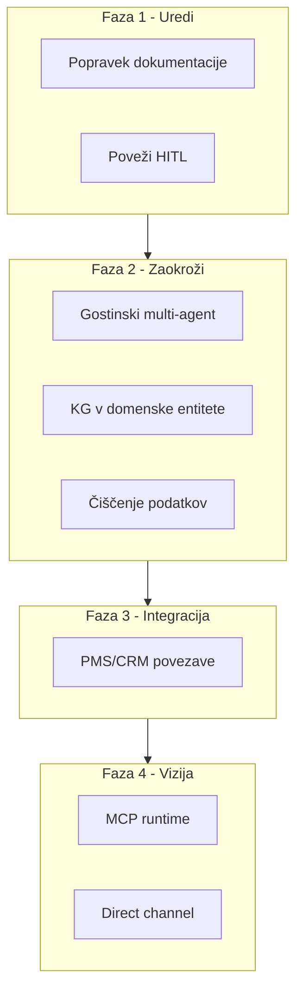

# Raziskava vs. Implementacija – Roadmap AgentFlow Pro

Združena logika iz primerjave obeh raziskav z dejansko implementacijo. Uporabi pri načrtovanju prioritet in popravljanju dokumentacije.

**Vir:** Turistična raziskava (AgentFlow Pro semantika, MCP, GEO) + PDF *Od MVP do Robustnega SaaS* + projekt (HONEST-FEEDBACK).

---

## 1. Urejanje dokumentacije

Raziskavi v nekaterih delih ne ustrezata implementaciji. Popravki za natančno odražanje trenutnega stanja:

| Kaj popraviti | Kje / kako |
|---------------|------------|
| MCP kot runtime integracija | Pojasniti: MCP je v Cursor za razvoj; v aplikaciji agenti uporabljajo REST API. |
| Ločeni »Storytelling Agent« in »Structured Agent« | Pojasniti: en Content Agent z različnima promptoma (Airbnb/Booking.com). |
| Triagentna gostinska komunikacija | Implementirano – Policy/Retrieval/Copy v FAQ flowu (guest-communication). |
| Metrike (RevPAR, +18 %, +25 %) | Označiti kot industrijske benchmarke, ne kot lastne podatke AgentFlow Pro. |
| Orodja za čiščenje podatkov | Implementirano – endpoint in UI v dashboard. |
| »Hotel MCP strežnik« | Premakniti v sekcijo vizije/roadmap. |
| Formula $R_e$ | Omeniti kot konceptualno merilo, ne kot izmerjeno vrednost. |

**Ločnica za raziskavo:**

- **Implementirano** – obstaja v kodi
- **Načrtovano** – roadmap
- **Vizija** – dolgoročna smer industrie

### 1.1 Referenčna tabela – Implementirano / Načrtovano / Vizija

| Trditev | Status | Opomba |
|---------|--------|--------|
| MCP kot runtime | Vizija | MCP je v Cursor za razvoj; v aplikaciji agenti uporabljajo REST API. |
| Storytelling vs Structured Agent | Implementirano | En Content Agent z različnima promptoma (Airbnb/Booking.com) v `src/data/prompts.ts`. |
| Triagentna gostinska komunikacija | Implementirano | Policy/Retrieval/Copy v FAQ flowu (guest-communication). |
| RevPAR, +18 %, +25 % | Referenca | Industrijske benchmarke, ne lastni podatki AgentFlow Pro. |
| Orodja za čiščenje podatkov | Implementirano | Endpoint in UI v dashboard. |
| Hotel MCP strežnik | Vizija | Dolgoročna smer – zunanji AI agenti kličejo hotelske podatke. |
| Formula $R_e$ | Referenca | Konceptualno merilo, ne izmerjena vrednost. |
| HITL chat flow | Implementirano | `hitl.ts` + chat route + ChatEscalation. `ai-agent-production-validation.ts` vsebuje konfiguracijo, ne runtime logiko. |

---

## 2. Prioritizirane implementacije

### A) Kratkoročno (zaokroži obstoječe)

1. **Poveži Human-in-the-loop z dejanskim flowom** (opravljeno)
   - Dejanska runtime logika je v `hitl.ts` (estimateConfidence, requiresEscalationForType) in chat route; ob confidence < 85 % (inquiry_response) se ustvari ChatEscalation.
   - `ai-agent-production-validation.ts` vsebuje konfiguracijske threshold-e (npr. 90 %), ne pa runtime escalation kode.
   - Uporabniški prikaz: banner "Pogovor bo prešel na človeka z vami." na chat stranici; staff dashboard `/dashboard/escalations`.

2. **Zmanjšaj pretirano trditve o agentih** (delno opravljeno)
   - V [FEATURES.md](FEATURES.md) dodano razjasnilo: za Airbnb/Booking.com je en Content Agent z platform-specific content templates, ne ločeni agenti.
   - UI (tourism generate) uporablja izraz "Platform-specifične predloge".

3. **Osnovno merjenje uspešnosti**
   - Če raziskava omenja RevPAR in konverzije, v analytics dodaj osnovne metrike (čas odziva, št. avtomatsko odgovorjenih sporočil).
   - Placeholder za prihodnji RevPAR, ko bo podatek na voljo.

### B) Srednjeročno (za uresničitev raziskave)

4. **Gostinski multi-agentni flow**
   - Če želiš triagentni model (Retrieval → Policy → Copy):
   - Retrieval Agent: dostopa do baze (Property, Guest, policies).
   - Policy Agent: preverjanje pravil (odpovedi, doplačila).
   - Copy Agent: oblikovanje končnega odgovora v brand tonu.
   - Lahko začneš poenostavljeno (npr. Retrieval + Copy), nato dodaš Policy.

5. **Povezava Knowledge Graph z uporabniškimi vprašanji**
   - KG obstaja (Entity, Relation). Razširi entitete na turistično domeno (Property, Guest, Reservation, Amenity, Policy).
   - Uporabi pri odgovorih na vprašanja o razpoložljivosti, zgodnji prijavi ipd.

6. **Orodje za čiščenje podatkov**
   - Deduplikacija (Guest, Reservation), prepoznavanje anomalij, harmonizacija polj.
   - Implementirano – endpoint in UI v dashboard.

7. **Integracija z resničnim PMS/CRM**
   - Za realno delovanje potrebuješ vsaj eno integracijo (Mews, Opera ali HubSpot).
   - Za začetek: en API, brez obetov "lastnega MCP strežnika".

### C) Dolgoročno (vizija)

8. **MCP kot runtime integracija**
   - Zgraditi MCP strežnik za AgentFlow Pro, da zunanji AI agenti kličejo hotelske podatke.
   - Strateška smer za "boj za direktni kanal".

9. **GEO in AI iskalniki**
   - GEO obstaja v `seo-optimizer.ts`. Razširiti: avtomatsko dodajanje FAQ, structured data za ChatGPT, Perplexity ipd.

---

## 3. Zaporedje faz

- **Faza 1:** Popravek dokumentacije + poveži HITL.
- **Faza 2:** Gostinski multi-agent, KG v domenske entitete, čiščenje podatkov.
- **Faza 3:** PMS/CRM integracije.
- **Faza 4:** MCP runtime, "direct channel".

---

## 4. Združeni prioritetni načrt (Bloki A–D)

Primerjava treh virov kaže na naslednje smiselne korake. Za podrobnosti glej PDF *Od MVP do Robustnega SaaS* v root projektu.

### Blok A: Takoj (1–2 tedna)

| # | Naloga | Vir | Razlog |
|---|--------|-----|--------|
| 1 | Vključi HITL v chat flow | Turistična raziskava | Opravljeno: hitl.ts + chat route + ChatEscalation + staff dashboard + Slack/Email obvestila. |
| 2 | Booking.com – začni registracijo | PDF, HONEST-FEEDBACK | 4–8 tednov čakanja; glej [BOOKING-COM-REGISTRATION.md](BOOKING-COM-REGISTRATION.md). |
| 3 | Popravek dokumentacije | Turistična raziskava | Jasna meja implementirano/načrtovano. |

### Blok B: Pred / med beta (2–4 tedni)

| # | Naloga | Vir | Razlog |
|---|--------|-----|--------|
| 4 | Stripe Live preverjanje | PDF | Ključi in webhooki morajo delati v produkciji. |
| 5 | Load test (k6) | PDF | Glej [LOAD-TEST-K6.md](LOAD-TEST-K6.md). |
| 6 | hreflang za SEO | PDF | Glej [HREFLANG-SEO.md](HREFLANG-SEO.md). |
| 7 | Preverjanje resilience v runtime | PDF | Glej [RESILIENCE-VERIFICATION.md](RESILIENCE-VERIFICATION.md). |

### Blok C: Srednjeročno (1–3 meseci)

| # | Naloga | Vir | Razlog |
|---|--------|-----|--------|
| 8 | Napovedovalna analitika | PDF | Diferenciator, višji pricing. |
| 9 | Gostinski multi-agent (Retrieval + Copy) | Turistična raziskava | Glej [GUEST-MULTI-AGENT.md](GUEST-MULTI-AGENT.md). |
| 10 | KG v turistične entitete | Turistična raziskava | Glej [KG-TOURISM-ENTITIES.md](KG-TOURISM-ENTITIES.md). |
| 11 | LangSmith ali podobno | PDF | Glej [LANGSMITH-SETUP.md](LANGSMITH-SETUP.md). |

### Blok D: Odloži (po beta / first customers)

| Naloga | Zakaj odložiti |
|--------|----------------|
| Agent containerization (RabbitMQ) | Preveč za MVP; monolit zadostuje. |
| MCP runtime | Vizija, ni potrebe za prvimi strankami. |
| Hibridni pricing (pay-as-you-go) | Stripe tiered zadostuje za začetek. |
| EU AI Act v compliance | Po stabilni beti. |

---

## 5. Priporočila za uporabo

- **Raziskava kot prodajni material:** Fokus na Fazo 1 (popravki) + jasna ločnica Implementirano / Načrtovano / Vizija.
- **Raziskava kot notranji roadmap:** Fokus na Faze 2–4; raziskava postane vodilo za prioritete razvoja.
- **MVP za gostinsko komunikacijo:** Faza 1 (HITL) + začetek Faze 2 (multi-agent, KG v turistične entitete).
- **Usklajevanje virov:** Turistična raziskava → AI (HITL, multi-agent, KG). PDF → produkcija (Booking.com, load test, hreflang, observability).

---

## 6. Kaj se sklada z raziskavo (referenca)

| Trditev | Dejansko stanje |
|---------|------------------|
| Knowledge Graph | Entity, Relation v `src/memory/`. Entitete: Agent, Workflow, Task, User, Deploy. |
| Airbnb storytelling vs Booking.com | Različni prompty v `src/data/prompts.ts`. En Content Agent, različni prompti. |
| GEO optimizacija | `seo-optimizer.ts`: suggestGeoHints(), suggestAeoHints(). |
| Odobritveni procesi | WorkflowCheckpoint + requiresApproval v WorkflowExecutor. |
| No-code vmesnik | React Flow workflow builder, checkbox requiresApproval. |
