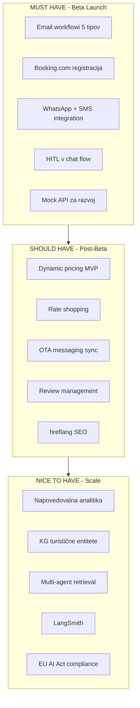

# Tourism Email Workflows – Roadmap & Research

Roadmap for implementing email automation, guest communications, pricing, dynamic pricing, and OTA API integrations in AgentFlow Pro (tourism vertical). This document contains comparison with proposal, verified benchmarks, key requirements, Booking.com Connectivity Hub, hospitality channels 2025, and implementation plan. For further research and opinions – see section at the end.

---

## 1. Comparison: Proposal vs. AgentFlow Pro (current state)

| Function | Proposal | AgentFlow Pro currently |
|----------|---------|------------------------|
| Event triggers (`reservation.created`, `check_in`, `check_out`) | Yes | No – no webhook on reservation creation |
| Time delays (`-7_days`, `+1_day`, `+60_days`) | Yes | Partial – `scheduledFor` manually, no scheduler |
| Channels (email, sms, whatsapp) | Yes | email, sms, phone – WhatsApp missing |
| Booking confirmation (immediate) | Yes | No |
| Pre-arrival (3–7 days) | Yes | Partial – type `pre-arrival`, no auto-trigger |
| Check-in instructions (24h before) | Yes | No – `check_in` in agent, no scheduler |
| During-stay upsell (day 2–3) | Yes | No |
| Post-stay review (24h after departure) | Yes | Partial – type `post-stay`, no auto-trigger |
| Re-booking campaign (30–90 days) | Yes | No |

---

## 2. Benchmark Research (verified sources)

| Statement in proposal | Research / sources | Realistic value |
|--------------------|------------------|----------------------|
| Booking confirmation 95% open | Revinate, MarTech: 56–72% for travel/transactional | **65–75%** |
| Pre-arrival 45% open | Mews, GuestTouch: up to ~60%, APAC 43–48% | **45% OK** |
| Check-in 24h: 60% open | No direct source – operational emails have higher open | **60% OK** |
| During stay 13x conversion | No source for "13x". Hospitalitynet: TRevPAR +2–5% | **High impact, 13x unproven** |
| Post-stay 35% response | GuestRevu: typically 20–22%, well optimized 25–35% | **35% = best case** |
| Re-booking 22% conversion | Revinate: 41% open, 5% CTR | **22% questionable – clearly define metric** |

### Reference Sources
- [Revinate 2025 Hospitality Benchmark](https://www.revinate.com/hospitality-benchmark-report/)
- [Mews – Hotel Pre-Arrival Emails](https://mews.com/en/blog/hotel-pre-arrival-emails)
- [GuestTouch – Pre-Arrival](https://www.guesttouch.com/blog/mastering-pre-arrival-emails-proven-templates-strategies-for-hotels-with-examples)
- [Hospitalitynet – Total revenue management](https://www.hospitalitynet.org/explainer/4129204.html)

---

## 3. Proposed `EMAIL_WORKFLOWS` Structure

```typescript
// src/lib/tourism/email-workflows.ts (or guest-email-workflows.ts)

export const EMAIL_WORKFLOWS = {
  booking_confirmation: {
    trigger: 'reservation.created',
    delay: 'immediate',
    channels: ['email', 'sms', 'whatsapp'],
    variables: ['guest_name', 'property_name', 'check_in', 'check_out', 'total_price']
  },
  pre_arrival: {
    trigger: 'reservation.check_in',
    delay: '-7_days',
    upsell_opportunities: ['airport_transfer', 'early_checkin', 'breakfast'],
    variables: ['local_events', 'weather_forecast', 'parking_info']
  },
  check_in_instructions: {
    trigger: 'reservation.check_in',
    delay: '-24h',
    channels: ['email', 'sms'],
    variables: ['access_info', 'parking', 'wifi', 'contact']
  },
  during_stay_upsell: {
    trigger: 'reservation.stay_day',
    delay: '+2_days',
    upsell_opportunities: ['spa', 'dining', 'late_checkout', 'room_upgrade'],
    variables: ['guest_preferences', 'previous_purchases']
  },
  post_stay_review: {
    trigger: 'reservation.check_out',
    delay: '+1_day',
    channels: ['email', 'sms'],
    review_platforms: ['Booking.com', 'Google', 'TripAdvisor']
  },
  re_booking_campaign: {
    trigger: 'reservation.check_out',
    delay: '+60_days',
    variables: ['seasonal_offers', 'loyalty_discount', 'same_dates_discount']
  }
}
```

---

## 4. Načrt implementacije

### Faza 1: Infrastruktura
- [ ] `EMAIL_WORKFLOWS` konfiguracija
- [ ] Daily cron / scheduler za časovno odvisne maile
- [ ] Event hook ob `reservation.created` (PMS sync ali manual create)

### Faza 2: Core workflowi
- [ ] Booking confirmation (takoj ob create)
- [ ] Pre-arrival (check_in - 7 dni)
- [ ] Check-in instructions (check_in - 24h)
- [ ] Post-stay review (check_out + 1 dan)

### Faza 3: Upsell & retention
- [ ] During-stay (check_in + 2 dni, dokler check_out)
- [ ] Re-booking (check_out + 60 dni)

### Faza 4: Kanali (gostinska sporočila)
- [ ] `src/lib/guest-communication.ts` – COMMUNICATION_CHANNELS, AI_MESSAGE_TYPES
- [ ] WhatsApp integracija (Twilio/Meta)
- [ ] OTA Messaging (Booking.com, Airbnb inbox)
- [ ] Review management – auto-responses, sentiment analysis

### Faza 5: Pricing Engine
- [ ] `src/lib/pricing-engine.ts` – PRICING_STRATEGIES konfiguracija
- [ ] Integracija s `competitor-prices` in `analytics` (occupancy)
- [ ] MVP: base_rate + rules (min_stay, early_bird, last_minute, weekend)
- [ ] Naprej: dynamic_adjustment faktorji

### Faza 6: OTA Integracije (Booking.com, Airbnb)
- [ ] `src/lib/booking-com-integration.ts` – BOOKING_COM_REQUIREMENTS
- [ ] Migracija na Connectivity Hub (OAuth 2.0 do Dec 2025)
- [ ] Rates & Availability API integracija
- [ ] Circuit breaker + retry za reservation fallback
- [ ] Airbnb: prek channel managerja ali Homes API partnerstvo

---

## 5. Ključne zahteve (email & komunikacija)

| Zahteva | Vir | AgentFlow Pro | Smiselnost |
|---------|-----|---------------|------------|
| Avtomatizirano sinhroniziranje gostinskih podatkov v email orodje | [Inntopia](https://corp.inntopia.com/email/) | PMS sync obstaja, Guest+Reservation v DB – ni avto-sync v email workflow | Visoka |
| Behavioral triggers (vedenje gostov) | [Revinate](https://www.revinate.com) | Samo ročno/scheduled – ni event-driven behavioral triggerjev | Visoka |
| Omnichannel (email + WhatsApp + SMS + OTA messaging) | [Hotelyearbook](https://www.hotelyearbook.com) | Email, sms, phone – WhatsApp in OTA messaging manjkata | Visoka |
| Personalizacija (imena, preference, zgodovina) | [SuitePad](https://www.suitepad.de) | Guest ima name, email, phone – ni preferenc, zgodovine bivanj, segmentacije | Visoka |

---

## 6. Ceniki & Dynamic Pricing

| Funkcija | Vir | AgentFlow Pro | Smiselnost |
|----------|-----|---------------|------------|
| Dynamic Pricing (real-time na povpraševanje) | [SiteMinder](https://www.siteminder.com), RateGain | Ni – basePrice statičen | Visoka |
| Rate Shopping (spremljanje OTA konkurence) | [RateTiger](https://ratetiger.com), [Makcorps](https://www.makcorps.com) | Competitor + CompetitorPrice – ročno scraping, brez real-time | Srednja |
| Seasonal Adjustments (4 sezone + event) | MySoftInn, RMS | SeasonalContentScheduler za vsebino, ne cene | Visoka |
| Length-of-Stay Pricing (popusti za daljša bivanja) | RoomPriceGenie, [Chekin](https://chekin.com) | Ni | Srednja |
| Last-Minute Deals (avtomatski popusti za prazne sobe) | HotelTechReport | Ni | Srednja |

**Prioriteta:** MVP začni s Seasonal + LOS; pravi rate shopping zahteva RateTiger/Makcorps API ali specializirano orodje.

---

## 7. Pricing Engine – predlog strukture

Datoteka `src/lib/pricing-engine.ts` trenutno **ne obstaja**. Predlagana struktura:

```typescript
// src/lib/pricing-engine.ts

export const PRICING_STRATEGIES = {
  base_rate: {
    type: 'fixed',
    variables: ['room_type', 'season', 'day_of_week']
  },
  dynamic_adjustment: {
    type: 'ai_optimized',
    factors: [
      'competitor_rates',
      'demand_forecast',
      'booking_pace',
      'local_events',
      'weather_forecast',
      'historical_occupancy'
    ],
    update_frequency: 'daily'
  },
  rules: {
    min_stay_discount: { threshold: 7, discount: '15%' },
    early_bird: { days_before: 60, discount: '10%' },
    last_minute: { days_before: 3, discount: '20%' },
    weekend_premium: { days: ['fri', 'sat'], premium: '25%' }
  }
}
```

**Ocena:** V skladu z industrijo (SiteMinder, RateTiger, RoomPriceGenie). Predlogi:
- `discount`/`premium` kot decimalna vrednost (0.15) za računanje
- Dodati `length_of_stay` s stopničastimi popusti (3 noči → 15%, 5 noči → 20%)
- `last_minute`: opcijsko `min_occupancy_threshold`

---

## 8. API integracije za Pricing

| API | Namen | Prioriteta | Opomba |
|-----|-------|------------|--------|
| [RateGain](https://www.rategain.com) | Rate shopping, competitor intelligence | Srednja | Uveljavljen v hotel tech |
| [SiteMinder](https://www.siteminder.com) | Channel management + pricing | Srednja | Dynamic Revenue Plus, večji obseg |
| **Booking.com Rates API** | Sinhronizacija cen (Connectivity Hub) | **Visoka** | OTA_HotelAvailNotif, OTA_RateAmountNotif, LOS |
| **Airbnb Pricing API** | Sinhronizacija cen | **Visoka** | Homes API – dostop prek channel managerjev ali partnerstva |

---

## 9. Booking.com Connectivity Hub – Rezervacije (minimum requirements)

| Zahteva | Vrednost | Rok | Vir |
|---------|----------|-----|-----|
| Reservation API Fallbacks | < 5% na mesec | Stalno | connectivity.booking.com |
| Authentication | Token-based (OAuth 2.0) | Dec 2025 | Basic auth sunset 31.12.2025 |
| Rates & Availability API | Real-time sync | Ob registraciji | [Rates & Availability](https://developers.booking.com/connectivity/docs/ari) |
| Content API | Modular API | H2 2025 | Roadmap |
| Payment Details API | New standard | May 2025 | [developers.booking.com](https://developers.booking.com/connectivity/docs) |
| Demand API | v3.2 Latest | Current | leapshq.com |
| OTA_HotelSummaryNotif | DEPRECATED | Dec 2026 removal | Preveri [Deprecation policy](https://developers.booking.com/connectivity/docs/deprecation-policy/deprecation-and-sunsetting) |

**Trenutno stanje AgentFlow Pro:** `integrations/bookingCom.ts` uporablja `distribution-xml.booking.com` (verjetno Distribution API), ne Connectivity Hub. Za Connectivity partner status potrebna migracija na Connectivity API + OAuth 2.0.

---

## 10. Booking.com Integration – predlog strukture

Datoteka `src/lib/booking-com-integration.ts` trenutno **ne obstaja**. Predlagana struktura:

```typescript
// src/lib/booking-com-integration.ts

export const BOOKING_COM_REQUIREMENTS = {
  certification: {
    timeline: '4-8_weeks',
    steps: [
      'partner_registration',
      'api_implementation',
      'testing_sandbox',
      'certification_audit',
      'production_go_live'
    ]
  },
  api_endpoints: {
    rates_availability: '/rates/2.0',
    reservations: '/reservations/1.0',
    content: '/content/1.0',
    payments: '/payments/1.0'
  },
  monitoring: {
    fallback_threshold: '5%',
    check_frequency: 'daily',
    alert_channels: ['email', 'slack', 'sentry']
  },
  fallback_strategy: {
    circuit_breaker: true,
    retry_logic: 'exponential_backoff',
    manual_override: true
  }
}
```

**Opomba:** Endpoint poti preveri v [API reference](https://developers.booking.com/connectivity/docs/api-reference). `fallback_threshold` kot ciljni KPI.

---

## 11. Kritični koraki (Booking.com Connectivity)

| Korak | Akcija |
|-------|--------|
| **DANES** | Začni registracijo kot Connectivity Partner na [connectivity.booking.com](https://connectivity.booking.com) / [partner.booking.com](https://partner.booking.com) |
| **Mock API** | Razvij mock sloj za razvoj brez čakanja na odobritev (AgentFlow ima `MockBookingComAPI`) |
| **Fallback** | Omogoči ročni vnos razpoložljivosti med čakanjem na API odobritev |
| **Monitoring** | Nastavi alerte za fallback rate > 5% |

---

## 12. Gostinska sporočila – 2025 trendi

| Kanal | Uporaba | Prioriteta | Vir | AgentFlow Pro |
|-------|---------|------------|-----|---------------|
| WhatsApp | Real-time, check-in | Visoka | [Chekin](https://chekin.com), SendSquared | Ne – manjka |
| SMS | Nujna obvestila, OTP | Visoka | [Canary](https://www.canarytechnologies.com) | Da |
| Email | Formalna sporočila, računi | Visoka | HotelTechReport | Da |
| OTA Messaging | Booking.com, Airbnb chat | Visoka | Hotelyearbook | Ne |
| Instagram/FB | Marketing, inquiries | Srednja | Hotelyearbook | Ne |
| In-App Chat | Lastna aplikacija | Nizka | Upriser | Delno – chat obstaja |

---

## 13. Guest Communication – predlog strukture

Datoteka `src/lib/guest-communication.ts` (ali `guest-communication-channels.ts`) trenutno **ne obstaja**. Predlagana struktura:

```typescript
// src/lib/guest-communication.ts

export const COMMUNICATION_CHANNELS = {
  whatsapp: {
    provider: 'Twilio/Meta',
    use_cases: ['check_in_instructions', 'upsell_offers', 'urgent_notifications'],
    response_time_sla: '<15_minutes'
  },
  sms: {
    provider: 'Twilio',
    use_cases: ['otp_verification', 'emergency_alerts', 'booking_confirmations'],
    response_time_sla: '<5_minutes'
  },
  email: {
    provider: 'SendGrid/Resend',
    use_cases: ['invoices', 'detailed_information', 'marketing_campaigns'],
    response_time_sla: '<1_hour'
  },
  ota_messaging: {
    platforms: ['Booking.com', 'Airbnb', 'Expedia'],
    use_cases: ['guest_inquiries', 'reservation_changes'],
    response_time_sla: '<1_hour'
  }
}

export const AI_MESSAGE_TYPES = {
  inquiry_response: { confidence_threshold: 0.85, hitl_below: true },
  upsell_offer: { confidence_threshold: 0.75, hitl_below: false },
  complaint_handling: { confidence_threshold: 0.90, hitl_below: true },
  review_response: { confidence_threshold: 0.80, hitl_below: true }
}
```

**Ocena:** Bolj granularen HITL po tipu sporočila kot trenutni enoten `CONFIDENCE_THRESHOLD = 0.9` v `src/lib/hitl.ts`.

---

## 14. Ključne zahteve (dopolnitev)

| Zahteva | Vir | AgentFlow Pro |
|---------|-----|---------------|
| Centraliziran dashboard – vsa sporočila na enem mestu | [Hoop](https://hoop.expert) | guest-communication dashboard – brez OTA/WhatsApp |
| AI + HITL – avtomatski odgovori + človeška validacija | [Callin](https://callin.io) | hitl.ts, guest-copy-agent – predlog AI_MESSAGE_TYPES |
| Response time SLA – &lt;15 min WhatsApp, &lt;1h email | [Canary](https://www.canarytechnologies.com) | Ni definirano |
| Upsell integration – avtomatske ponudbe med bivanjem | HotelTechnologyNews | Ni |

---

## 15. Konkurenčna analiza

### Jasper alternatives (general AI content)

| Orodje | Cena | Turizem | Vir |
|--------|------|---------|-----|
| Copy.ai | $49/mesec | Ne | republishai.com |
| Writesonic | $20/mesec | Ne | wpmet.com |
| Rytr | $9/mesec | Ne | eesel.ai |
| ContentMonk | $99/mesec | Ne | contentmonk.io |
| **AgentFlow Pro** | $59–499/mesec | **Da** | – |

### Turizem-specifične platforme (2025)

| Platforma | Fokus | Cena | Manjka | Vir |
|-----------|-------|------|--------|-----|
| Revinate | Email marketing | $299+/mesec | AI agenti, workflow | revinate.com |
| Cendyn | Guest communication | Custom | Multi-agent, KG | hoteltechreport.com |
| Hoop | Omnichannel messaging | $199+/mesec | Content generation | hoop.expert |
| Enso Connect | Short-term rental AI | $99+/mesec | Hotels, DMO | ensoconnect.com |
| Guesty | Airbnb automation | $99+/mesec | Content, SEO | guesty.com |
| RateGain | Pricing intelligence | Custom | Content, communication | rategain.com |

### AgentFlow Pro diferenciatorji

- Multi-Agent Flow – Research + Content + Reservation + Communication
- Knowledge Graph – Turistične entitete, kontekstualni odgovori
- Unified Platform – content + rezervacije + komunikacija na enem mestu
- Pay-per-use – fleksibilnejši pricing
- Compliance – GDPR, EU AI Act, licenciranje

---

## 16. Implementacijski plan po blokih

### Blok A: Takoj (1–2 tedna)

| # | Funkcija | Vir |
|---|----------|-----|
| 1 | Email workflowi – 5 templatov (booking, pre-arrival, during, post-stay, re-book) | Revinate |
| 2 | Booking.com registracija – začni DANES | connectivity.booking.com |
| 3 | WhatsApp integration – Twilio/Meta API | Chekin |
| 4 | HITL v chat – confidence threshold + escalation | Callin |
| 5 | Mock Booking API – razvoj brez čakanja | lodgify.com |

### Blok B: Pred/med beta (2–4 tedni)

| # | Funkcija | Vir |
|---|----------|-----|
| 6 | Dynamic pricing MVP – basic rules + seasonal | SiteMinder |
| 7 | Rate shopping integration | Makcorps |
| 8 | OTA messaging sync – Booking.com + Airbnb chat | Hotelyearbook |
| 9 | Review management – auto-responses + sentiment | Hoop |
| 10 | hreflang SEO – 3 jeziki (EN, DE, IT) | **Implementirano** – HREFLANG-SEO.md |

### Blok C: Srednjeročno (1–3 meseci)

| # | Funkcija | Vir |
|---|----------|-----|
| 11 | Napovedovalna analitika – demand forecasting | HotelTechReport |
| 12 | KG turistične entitete | aitechinsights.com |
| 13 | Multi-agent retrieval – Research + Copy | Callin |
| 14 | LangSmith integration | **Dokumentirano** – LANGSMITH-SETUP.md |
| 15 | EU AI Act compliance | hotelsmarters.com |

---

## 17. Prioritetni diagram



---

## 18. Ena vrstica za akcijo

| Obdobje | Akcije |
|---------|--------|
| **Danes** | Začni Booking.com registracijo + implementiraj 5 email workflowov + WhatsApp integration |
| **Ta teden** | HITL v chat + mock API za razvoj |
| **Naslednji teden** | Dynamic pricing MVP + rate shopping + OTA messaging |
| **Po beta** | Napovedovalna analitika + KG + LangSmith |

---

## 19. Trenutna koda (reference)

- `src/app/api/tourism/guest-communication/route.ts` – GET/POST guest emails
- `src/agents/communication/communicationAgent.ts` – messageType: pre_arrival, post_stay, check_in, check_out
- `src/workflows/tourism-workflows.ts` – `guest_automation` use case
- `src/app/api/tourism/pms-sync/route.ts` – rezervacije iz PMS (brez triggerja)
- `src/app/api/tourism/competitor-prices/route.ts` – competitor tracking (za pricing-engine)
- `src/app/api/tourism/analytics/route.ts` – occupancy (za pricing-engine)
- `src/integrations/bookingCom.ts` – Distribution API (migracija na Connectivity Hub)
- `src/lib/booking-com-partnership.ts` – partnership application
- `src/lib/hitl.ts` – CONFIDENCE_THRESHOLD 0.9 (predlog: AI_MESSAGE_TYPES po tipu)
- `src/lib/tourism/guest-copy-agent.ts` – confidence v odgovorih
- `docs/BOOKING-COM-REGISTRATION.md` – koraki registracije
- `prisma`: `GuestCommunication`, `Reservation`, `Guest`, `Competitor`, `CompetitorPrice`

---

## 20. Raziskave in mnenja – za dopolnitev

*Tu dodajaj nove raziskave, vire in mnenja. Datum in kratek opis.*

<!--
Primer:
- 2025-02-XX: [vir] – XYZ finding
- 2025-02-XX: Mnenje: prioriteta during-stay pred re-booking
-->
