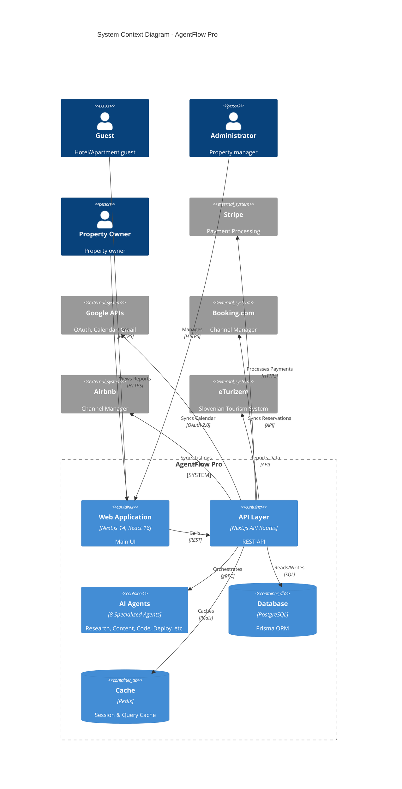
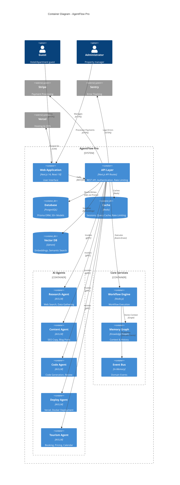
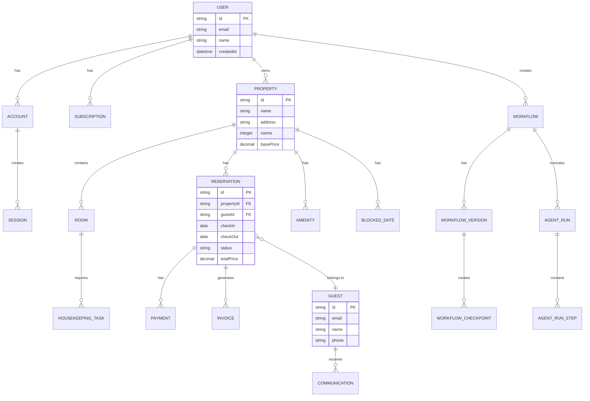
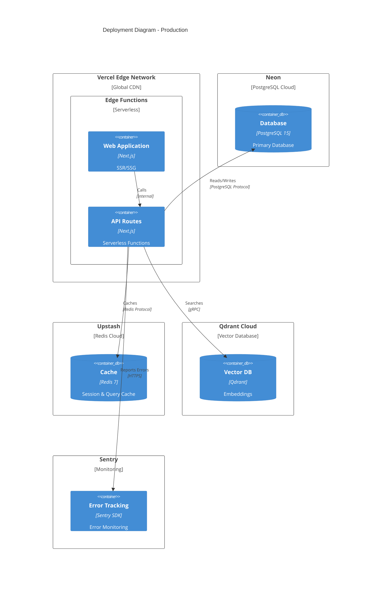
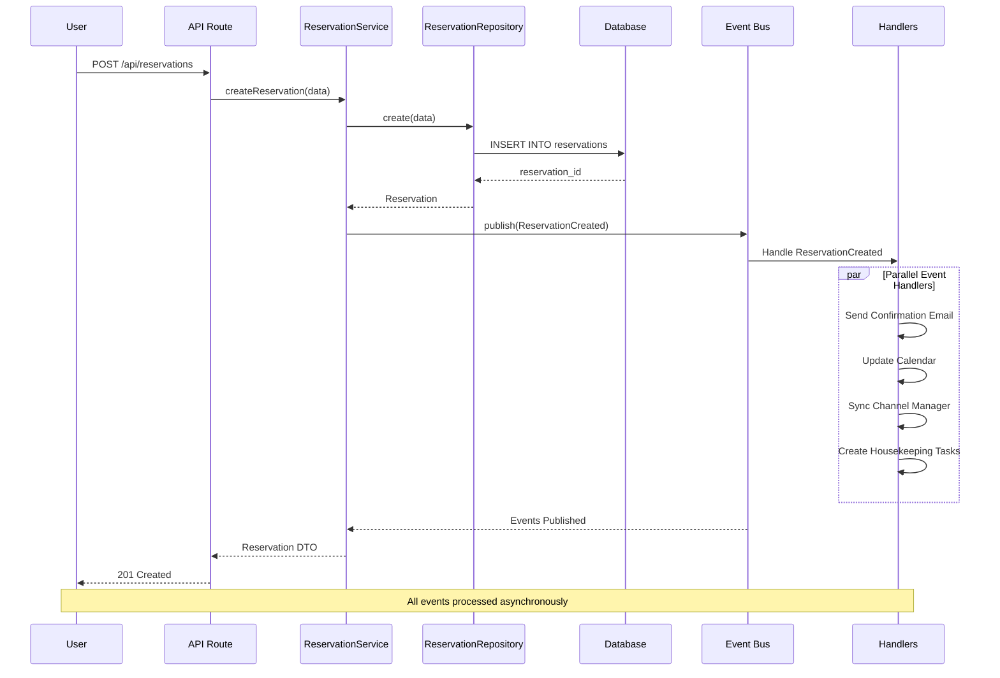
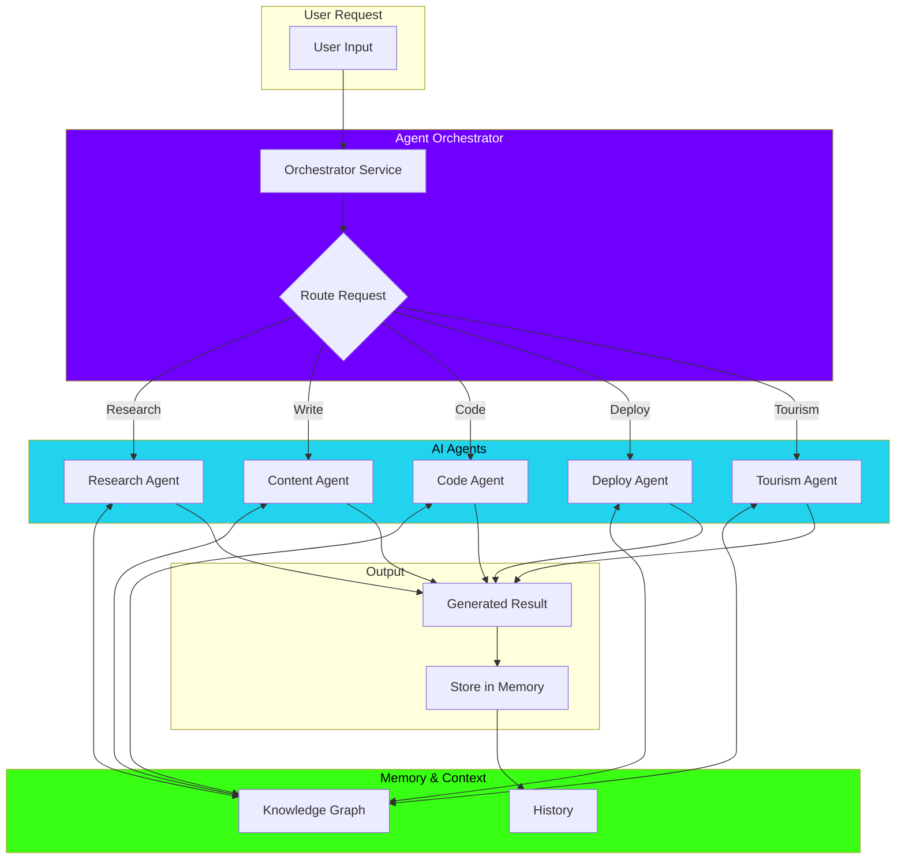

# 🏗️ AgentFlow Pro - Architecture Documentation

## System Overview

AgentFlow Pro is a multi-agent AI platform for business automation, specifically designed for tourism and hospitality management.

---

## Architecture Diagrams

### C4 Model - Level 1: System Context



---

### C4 Model - Level 2: Container Diagram



---

### C4 Model - Level 3: Component Diagram (API Layer)

```mermaid
C4Component
  title Component Diagram - API Layer

  Container_Boundary(api, "API Layer") {
    Component(auth, "Authentication", "NextAuth.js", "JWT, OAuth, Session Management")
    Component(middleware, "Middleware", "Next.js", "Security Headers, Rate Limiting, CORS")
    
    Component_Boundary(properties, "Properties API") {
      Component(prop_controller, "PropertyController", "TypeScript", "CRUD Operations")
      Component(prop_service, "PropertyService", "TypeScript", "Business Logic")
      Component(prop_repo, "PropertyRepository", "TypeScript", "Database Access")
    }

    Component_Boundary(reservations, "Reservations API") {
      Component(res_controller, "ReservationController", "TypeScript", "Booking Logic")
      Component(res_service, "ReservationService", "TypeScript", "Pricing, Availability")
      Component(res_repo, "ReservationRepository", "TypeScript", "Database Access")
    }

    Component_Boundary(guests, "Guests API") {
      Component(guest_controller, "GuestController", "TypeScript", "Guest Management")
      Component(guest_service, "GuestService", "TypeScript", "Communication")
      Component(guest_repo, "GuestRepository", "TypeScript", "Database Access")
    }
  }

  ContainerDb(db, "Database", "PostgreSQL", "Properties, Reservations, Guests")
  ContainerDb(cache, "Cache", "Redis", "Session Data")

  Rel(auth, middleware, "Validates", "JWT")
  Rel(middleware, prop_controller, "Routes", "HTTP")
  Rel(middleware, res_controller, "Routes", "HTTP")
  Rel(middleware, guest_controller, "Routes", "HTTP")

  Rel(prop_controller, prop_service, "Calls", "TypeScript")
  Rel(prop_service, prop_repo, "Calls", "TypeScript")
  Rel(prop_repo, db, "Reads/Writes", "SQL")

  Rel(res_controller, res_service, "Calls", "TypeScript")
  Rel(res_service, res_repo, "Calls", "TypeScript")
  Rel(res_repo, db, "Reads/Writes", "SQL")
  Rel(res_service, cache, "Caches", "Redis")

  Rel(guest_controller, guest_service, "Calls", "TypeScript")
  Rel(guest_service, guest_repo, "Calls", "TypeScript")
  Rel(guest_repo, db, "Reads/Writes", "SQL")

  UpdateLayoutConfig($c4ShapeInRow="3", $c4BoundaryInRow="3")
```

---

### Database Schema (ERD)



---

### Deployment Architecture



---

### Event Flow - Reservation Creation



---

### Agent Orchestration Flow



---

## System Overview

AgentFlow Pro is a multi-agent AI platform for business automation, specifically designed for tourism and hospitality management.

---

## High-Level Architecture

```
┌─────────────────────────────────────────────────────────────┐
│                      Client Layer                            │
│  ┌──────────┐  ┌──────────┐  ┌──────────┐  ┌──────────┐   │
│  │   Web    │  │  Mobile  │  │   API    │  │ Webhooks │   │
│  │   App    │  │   App    │  │ Clients  │  │          │   │
│  └──────────┘  └──────────┘  └──────────┘  └──────────┘   │
└─────────────────────────────────────────────────────────────┘
                            │
                            ▼
┌─────────────────────────────────────────────────────────────┐
│                    Presentation Layer                        │
│  ┌──────────────────────────────────────────────────────┐  │
│  │              Next.js 14 (React 18)                   │  │
│  │  - Server Components  - Client Components            │  │
│  │  - API Routes         - Middleware                   │  │
│  └──────────────────────────────────────────────────────┘  │
└─────────────────────────────────────────────────────────────┘
                            │
                            ▼
┌─────────────────────────────────────────────────────────────┐
│                    Application Layer                         │
│  ┌────────────┐  ┌────────────┐  ┌────────────┐            │
│  │  Services  │  │   Use      │  │   Agents   │            │
│  │            │  │   Cases    │  │  (8 types) │            │
│  └────────────┘  └────────────┘  └────────────┘            │
│  ┌────────────┐  ┌────────────┐  ┌────────────┐            │
│  │ Workflows  │  │  Events    │  │  Memory    │            │
│  │            │  │  Handlers  │  │   Graph    │            │
│  └────────────┘  └────────────┘  └────────────┘            │
└─────────────────────────────────────────────────────────────┘
                            │
                            ▼
┌─────────────────────────────────────────────────────────────┐
│                     Domain Layer                             │
│  ┌────────────┐  ┌────────────┐  ┌────────────┐            │
│  │ Entities   │  │  Value     │  │  Domain    │            │
│  │            │  │  Objects   │  │  Services  │            │
│  └────────────┘  └────────────┘  └────────────┘            │
│  ┌────────────┐  ┌────────────┐                             │
│  │ Aggregates │  │  Domain    │                             │
│  │            │  │  Events    │                             │
│  └────────────┘  └────────────┘                             │
└─────────────────────────────────────────────────────────────┘
                            │
                            ▼
┌─────────────────────────────────────────────────────────────┐
│                 Infrastructure Layer                         │
│  ┌────────────┐  ┌────────────┐  ┌────────────┐            │
│  │ Database   │  │   Cache    │  │   External │            │
│  │  (Prisma)  │  │  (Redis)   │  │   APIs     │            │
│  └────────────┘  └────────────┘  └────────────┘            │
│  ┌────────────┐  ┌────────────┐  ┌────────────┐            │
│  │   Event    │  │   File     │  │   Message  │            │
│  │   Sourcing │  │  Storage   │  │   Queue    │            │
│  └────────────┘  └────────────┘  └────────────┘            │
└─────────────────────────────────────────────────────────────┘
```

---

## Technology Stack

### Frontend
- **Framework:** Next.js 14 (App Router)
- **Language:** TypeScript 5
- **UI Library:** React 18
- **Styling:** Tailwind CSS 3
- **Components:** shadcn/ui
- **State:** React Context, Zustand
- **Forms:** React Hook Form, Zod

### Backend
- **Runtime:** Node.js 20
- **Framework:** Next.js API Routes
- **ORM:** Prisma 5
- **Database:** PostgreSQL 15
- **Cache:** Redis (Upstash)
- **Auth:** NextAuth.js 4
- **Validation:** Zod

### AI/ML
- **LLM Providers:** OpenAI, Gemini, Claude
- **Agents:** 8 specialized agents
- **Memory:** Knowledge Graph
- **Embeddings:** Vector search (Qdrant)

### Infrastructure
- **Hosting:** Vercel
- **Database:** Neon/Supabase
- **Cache:** Upstash Redis
- **Monitoring:** Sentry
- **CI/CD:** GitHub Actions

---

## Database Schema

### Core Models (50+)

```
User ────────────────< Account
  │                       │
  │                       └────────────> Session
  │
  ├───────────────< Subscription
  │
  ├───────────────< Property
  │                   │
  │                   ├──────────────> Room
  │                   │                   │
  │                   │                   └────> HousekeepingTask
  │                   │
  │                   ├──────────────> Reservation
  │                   │                   │
  │                   │                   ├────> Payment
  │                   │                   │
  │                   │                   └────> Invoice
  │                   │
  │                   └──────────────> Guest
  │                                       │
  │                                       └────> Communication
  │
  └───────────────< Workflow
                      │
                      ├──────────────> WorkflowVersion
                      │
                      └──────────────> AgentRun
```

### Key Relationships

1. **User → Property** (One-to-Many)
2. **Property → Room** (One-to-Many)
3. **Property → Reservation** (One-to-Many)
4. **Reservation → Guest** (Many-to-One)
5. **Reservation → Payment** (One-to-Many)
6. **Workflow → WorkflowVersion** (One-to-Many)

---

## Agent Architecture

### 8 Specialized Agents

```
┌─────────────────────────────────────────────────────────┐
│                   Agent Orchestrator                     │
└─────────────────────────────────────────────────────────┘
                          │
        ┌─────────────────┼─────────────────┐
        │                 │                 │
        ▼                 ▼                 ▼
┌──────────────┐  ┌──────────────┐  ┌──────────────┐
│  Research    │  │   Content    │  │    Code      │
│   Agent      │  │    Agent     │  │    Agent     │
│              │  │              │  │              │
│ - Web search │  │ - SEO copy   │  │ - Generate   │
│ - Data gather│  │ - Blog posts │  │   code       │
│ - Analysis   │  │ - Landing    │  │ - Review     │
└──────────────┘  └──────────────┘  └──────────────┘
        │                 │                 │
        └─────────────────┼─────────────────┘
                          │
        ┌─────────────────┼─────────────────┐
        │                 │                 │
        ▼                 ▼                 ▼
┌──────────────┐  ┌──────────────┐  ┌──────────────┐
│   Deploy     │  │  Tourism     │  │  Concierge   │
│   Agent      │  │   Agent      │  │    Agent     │
│              │  │              │  │              │
│ - Vercel     │  │ - Booking    │  │ - Guest      │
│ - Netlify    │  │ - Calendar   │  │   requests   │
│ - Docker     │  │ - Pricing    │  │ - Support    │
└──────────────┘  └──────────────┘  └──────────────┘
```

---

## Security Architecture

### Defense in Depth

```
┌─────────────────────────────────────────────────────────┐
│                    Edge Layer                            │
│  - DDoS Protection (Vercel Edge)                        │
│  - WAF (Web Application Firewall)                       │
│  - Rate Limiting (100 req/min)                          │
└─────────────────────────────────────────────────────────┘
                          │
                          ▼
┌─────────────────────────────────────────────────────────┐
│                 Application Security                     │
│  - Authentication (NextAuth.js)                         │
│  - Authorization (RBAC)                                 │
│  - Input Validation (Zod)                               │
│  - XSS Prevention (CSP)                                 │
│  - CSRF Protection                                      │
└─────────────────────────────────────────────────────────┘
                          │
                          ▼
┌─────────────────────────────────────────────────────────┐
│                    Data Security                         │
│  - Encryption at Rest (PostgreSQL TDE)                  │
│  - Encryption in Transit (TLS 1.3)                      │
│  - Secrets Management (Environment Variables)           │
│  - Audit Logging (Event Sourcing)                       │
└─────────────────────────────────────────────────────────┘
```

### Security Headers

- Content-Security-Policy
- Strict-Transport-Security
- X-Content-Type-Options
- X-Frame-Options
- X-XSS-Protection
- Referrer-Policy
- Permissions-Policy

---

## Performance Architecture

### Caching Strategy

```
┌─────────────────────────────────────────────────────────┐
│                   CDN Layer (Vercel)                     │
│  - Static Assets (immutable)                            │
│  - ISR Pages (60s TTL)                                  │
│  - Edge Cache (global)                                  │
└─────────────────────────────────────────────────────────┘
                          │
                          ▼
┌─────────────────────────────────────────────────────────┐
│                 Application Cache (Redis)                │
│  - Session Data (30d TTL)                               │
│  - API Responses (5m TTL)                               │
│  - Rate Limit Counters (1m TTL)                         │
└─────────────────────────────────────────────────────────┘
                          │
                          ▼
┌─────────────────────────────────────────────────────────┐
│                  Database (PostgreSQL)                   │
│  - Connection Pooling (20 connections)                  │
│  - Query Caching (via Prisma)                           │
│  - Index Optimization                                   │
└─────────────────────────────────────────────────────────┘
```

### Bundle Optimization

- Code Splitting (automatic)
- Lazy Loading (dynamic imports)
- Tree Shaking (ES modules)
- Image Optimization (Next.js Image)
- Font Optimization (next/font)

---

## Deployment Architecture

### Vercel Platform

```
┌─────────────────────────────────────────────────────────┐
│                    Vercel Edge Network                   │
│  - 100+ PoPs worldwide                                  │
│  - Automatic SSL                                        │
│  - Smart CDN                                            │
└─────────────────────────────────────────────────────────┘
                          │
                          ▼
┌─────────────────────────────────────────────────────────┐
│                 Serverless Functions                     │
│  - Auto-scaling                                         │
│  - Cold start optimization                              │
│  - Memory: 1024 MB                                      │
│  - Timeout: 60 seconds                                  │
└─────────────────────────────────────────────────────────┘
```

### Self-Hosted (Docker)

```yaml
services:
  app:
    image: agentflow-pro:latest
    ports:
      - "3002:3000"
    environment:
      - DATABASE_URL=postgresql://...
      - REDIS_URL=redis://...
    depends_on:
      - postgres
      - redis
  
  postgres:
    image: postgres:15-alpine
    volumes:
      - postgres_data:/var/lib/postgresql/data
  
  redis:
    image: redis:7-alpine
    volumes:
      - redis_data:/data
```

---

## Monitoring & Observability

### Three Pillars

1. **Logs** (Pino + Sentry)
   - Application logs
   - Error logs
   - Audit logs

2. **Metrics** (Vercel Analytics)
   - Response times
   - Error rates
   - Throughput

3. **Traces** (Sentry)
   - Request tracing
   - Database queries
   - External API calls

### Alerting

- Error rate > 1%
- Response time > 3s
- Database connection failures
- Rate limit breaches

---

## Development Workflow

```
Developer ──┬──> Local Development (npm run dev)
            │
            ├──> Pull Request
            │       │
            │       ├──> GitHub Actions (CI)
            │       │     - Lint
            │       │     - Test
            │       │     - Build
            │       │
            │       └──> Code Review
            │
            └──> Merge to Main
                    │
                    ├──> Vercel Deploy (Preview)
                    │
                    └──> Production Deploy
```

---

## Directory Structure

```
agentflow-pro/
├── src/
│   ├── app/              # Next.js App Router
│   │   ├── api/          # API Routes (79 endpoints)
│   │   ├── dashboard/    # Dashboard Pages
│   │   └── (auth)/       # Auth Pages
│   ├── components/       # React Components (36 dirs)
│   ├── lib/              # Utilities (95 modules)
│   ├── infrastructure/   # Infrastructure Layer
│   │   ├── database/     # Prisma & Repositories
│   │   ├── events/       # Event Bus
│   │   └── observability/# Logging & Monitoring
│   ├── core/             # Domain Layer
│   │   ├── domain/       # Domain Logic
│   │   └── use-cases/    # Application Use Cases
│   ├── features/         # Feature Modules
│   │   ├── agents/       # AI Agents
│   │   ├── tourism/      # Tourism Features
│   │   └── workflows/    # Workflow Engine
│   └── hooks/            # React Hooks
├── prisma/
│   ├── schema.prisma     # Database Schema (1865 lines)
│   ├── migrations/       # Database Migrations (32)
│   └── seed.ts           # Seed Data
├── tests/
│   ├── e2e/              # E2E Tests (8 tests)
│   ├── integration/      # Integration Tests
│   └── unit/             # Unit Tests
├── scripts/              # Utility Scripts (116)
└── .github/
    └── workflows/        # CI/CD (11 workflows)
```

---

## Design Patterns

### 1. Repository Pattern

```typescript
interface IRepository<T> {
  findById(id: string): Promise<T | null>;
  findAll(): Promise<T[]>;
  create(data: CreateDTO): Promise<T>;
  update(id: string, data: UpdateDTO): Promise<T>;
  delete(id: string): Promise<void>;
}

class PropertyRepository implements IRepository<Property> {
  // Implementation
}
```

### 2. Service Layer

```typescript
class PropertyService {
  constructor(
    private propertyRepo: PropertyRepository,
    private eventBus: EventBus
  ) {}

  async createProperty(data: CreatePropertyDTO) {
    const property = await this.propertyRepo.create(data);
    await this.eventBus.publish(new PropertyCreatedEvent(property));
    return property;
  }
}
```

### 3. Event Sourcing

```typescript
class WorkflowEventStore {
  async appendEvents(workflowId: string, events: DomainEvent[]) {
    for (const event of events) {
      await this.prisma.workflowEvent.create({
        data: {
          workflowId,
          type: event.type,
          payload: event.payload,
        },
      });
    }
  }

  async getHistory(workflowId: string): Promise<DomainEvent[]> {
    const events = await this.prisma.workflowEvent.findMany({
      where: { workflowId },
      orderBy: { timestamp: 'asc' },
    });
    return events.map(e => this.hydrateEvent(e));
  }
}
```

---

## API Design

### RESTful Endpoints

```
GET    /api/properties           # List properties
POST   /api/properties           # Create property
GET    /api/properties/:id       # Get property
PUT    /api/properties/:id       # Update property
DELETE /api/properties/:id       # Delete property

GET    /api/reservations         # List reservations
POST   /api/reservations         # Create reservation
GET    /api/reservations/:id     # Get reservation
PUT    /api/reservations/:id     # Update reservation
DELETE /api/reservations/:id     # Cancel reservation
```

### Request/Response Format

```typescript
// Request
POST /api/properties
{
  "name": "Beach Resort",
  "address": "123 Ocean Drive",
  "rooms": 10
}

// Response
{
  "success": true,
  "data": {
    "id": "prop_123",
    "name": "Beach Resort",
    "address": "123 Ocean Drive",
    "rooms": 10,
    "createdAt": "2026-03-15T10:00:00Z"
  }
}
```

---

## Future Architecture

### Phase 2 (Q2 2026)
- [ ] Mobile App (React Native)
- [ ] Multi-language (i18n)
- [ ] Advanced Analytics (ML)

### Phase 3 (Q3 2026)
- [ ] Voice Assistant
- [ ] Advanced Workflows
- [ ] API Marketplace

### Phase 4 (Q4 2026)
- [ ] Multi-property Enterprise
- [ ] Predictive Analytics
- [ ] White-label Solution

---

**Last Updated:** 2026-03-15  
**Version:** 1.0.0  
**Maintained By:** Architecture Team
